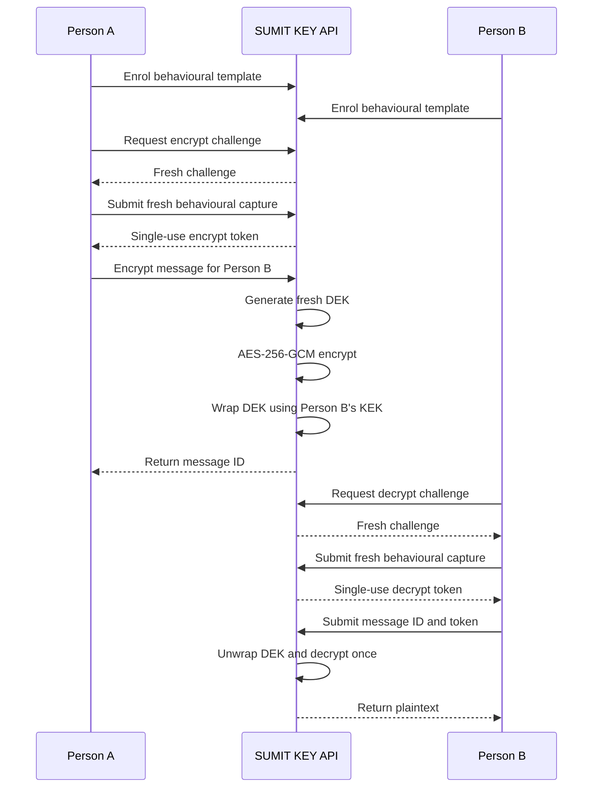

<div align="center">

# 🔐 SUMIT KEY

### Behavioural Authentication for Secure Messaging

**Mouse-movement and keystroke-timing authentication with ephemeral AES-256-GCM encryption, replay protection and experimental OTP/NFC fallback**

<br/>

[](#versioning)
[](#security-limitations)
[](https://www.python.org/)
[](https://fastapi.tiangolo.com/)
[](https://csrc.nist.gov/pubs/sp/800/38/d/final)
[](https://www.rfc-editor.org/rfc/rfc5869)
[](SECURITY.md)
[](#license)

</div>

<br/>

<p align="center">
<b>An MSc cybersecurity research prototype combining behavioural authentication with independently generated cryptographic keys in a replay-resistant two-user messaging workflow.</b>
</p>

> [!IMPORTANT]
> SUMIT KEY is a controlled academic research prototype. It is not production-ready and should not be used to protect real confidential, financial, medical or legally sensitive information.

---

## Table of Contents

* [Overview](#overview)
* [Research Aim and Questions](#research-aim-and-questions)
* [Key Concepts](#key-concepts)
* [Security Model](#security-model)
* [Quick Start](#quick-start)
* [Architectural Foundation](#architectural-foundation)

  * [Layer 1: Behavioural Capture](#layer-1-behavioural-capture)
  * [Layer 2: Feature Extraction](#layer-2-feature-extraction)
  * [Layer 3: Authentication and Replay Control](#layer-3-authentication-and-replay-control)
  * [Layer 4: KEK and DEK Management](#layer-4-kek-and-dek-management)
  * [Layer 5: Message Encryption](#layer-5-message-encryption)
  * [Layer 6: API and Fallback Authentication](#layer-6-api-and-fallback-authentication)
* [End-to-End Workflow](#end-to-end-workflow)
* [Installation](#installation)
* [Configuration](#configuration)
* [Running the Application](#running-the-application)
* [API Reference](#api-reference)
* [Browser Extension](#browser-extension)
* [Research and Evaluation](#research-and-evaluation)
* [Testing](#testing)
* [Threat Model](#threat-model)
* [Key Material Hygiene](#key-material-hygiene)
* [Legal, Social, Ethical and Professional Issues](#legal-social-ethical-and-professional-issues)
* [Security Limitations](#security-limitations)
* [Project Layout](#project-layout)
* [Dependency Matrix](#dependency-matrix)
* [Standards and References](#standards-and-references)
* [License](#license)
* [Versioning](#versioning)
* [Support](#support)

---

## Overview

SUMIT KEY investigates whether mouse-movement and keystroke-timing characteristics can authenticate enrolled users while cryptographic keys are generated and managed separately.

Behavioural information is used only as authentication evidence. It is not used to generate, reproduce or replace the message-encryption key. This separation prevents normal behavioural variation from directly determining the cryptographic key.

After Person A is authenticated, the application generates a fresh 32-byte Data Encryption Key (DEK) using the operating-system cryptographically secure pseudorandom number generator:

```python
os.urandom(32)
```

The message is encrypted using AES-256-GCM. The DEK is then wrapped using a Key Encryption Key (KEK) associated with Person B. Person B must authenticate independently before the application unwraps the DEK and decrypts the message.

```text
Person A
   ↓
Fresh behavioural challenge
   ↓
Mouse and keystroke verification
   ↓
Single-use authentication token
   ↓
Fresh random message DEK
   ↓
AES-256-GCM encryption
   ↓
DEK wrapped using Person B's KEK
   ↓
Encrypted message package
   ↓
Independent Person B authentication
   ↓
DEK unwrap and one-time decryption
```

### Final Implementation

The authoritative final implementation is:

```text
app.py — SUMIT KEY Fixed Core API, version 3.0.0
```

Older modules such as `api.py`, `main.py`, `capture.py`, `entropy_engine.py`, `key_generator.py` and parts of `sdk/` are retained as legacy or experimental components. They do not represent the corrected final dissertation workflow.

---

## Research Aim and Questions

### Research Aim

To design, implement and critically evaluate a two-user secure-messaging prototype in which mouse-movement and keystroke-timing characteristics authenticate users, ephemeral message-specific DEKs support AES-256-GCM encryption, and replay-resistant OTP and NFC mechanisms provide fallback authentication.

### Research Questions

| ID      | Research question                                                                                                    |
| ------- | -------------------------------------------------------------------------------------------------------------------- |
| **RQ1** | How effectively can mouse-movement and keystroke-timing features authenticate enrolled users?                        |
| **RQ2** | How effectively can an ephemeral KEK/DEK architecture support secure Person A-to-Person B AES-256-GCM communication? |
| **RQ3** | How effectively can challenges, authentication tokens and one-time message controls mitigate replay attacks?         |
| **RQ4** | How effectively can OTP and NFC mechanisms provide fallback authentication when behavioural verification fails?      |

### Research Objectives

1. Capture mouse movement and timing-only keystroke information.
2. Implement behavioural enrolment and authentication.
3. Develop secure per-user KEK management.
4. Generate an independent DEK for every message.
5. Implement AES-256-GCM authenticated encryption.
6. Support independent Person A and Person B authentication.
7. Implement replay-resistant challenges, tokens and message controls.
8. Implement OTP and NFC fallback authentication.
9. Evaluate authentication accuracy and system performance.
10. Critically assess security, accessibility and practical limitations.

---

## Key Concepts

| Concept                       | Description                                                                                                         |
| ----------------------------- | ------------------------------------------------------------------------------------------------------------------- |
| **Behavioural capture**       | Mouse coordinates, movement timestamps, keystroke dwell time and flight time collected for authentication analysis. |
| **Behavioural template**      | A normalised feature vector produced during user enrolment.                                                         |
| **Fresh capture**             | A new behavioural sample submitted in response to a short-lived authentication challenge.                           |
| **Authentication challenge**  | A fresh nonce-based request that must be completed before its expiry time.                                          |
| **Authentication token**      | A short-lived, purpose-bound and single-use token issued after successful authentication.                           |
| **Stable user secret**        | A random secret generated during enrolment and protected using the server master key.                               |
| **Key Encryption Key (KEK)**  | A user-specific 256-bit key derived from the stable secret using HKDF-SHA256.                                       |
| **Data Encryption Key (DEK)** | A fresh random 256-bit key generated independently for each message.                                                |
| **Authenticated encryption**  | AES-256-GCM encryption providing message confidentiality and integrity.                                             |
| **DEK wrapping**              | Encryption of the message DEK using the intended recipient’s KEK.                                                   |
| **Replay detection**          | Rejection of reused challenges, behavioural traces, authentication tokens and messages.                             |
| **OTP fallback**              | Experimental email/phone OTP verification with expiry, resend and attempt controls.                                 |
| **NFC fallback**              | Simulated HMAC challenge-response authentication that does not trust an NFC UID alone.                              |

---

## Security Model

SUMIT KEY is based on a trusted-server security model.

The application server:

* stores encrypted stable user secrets in process memory;
* performs behavioural verification;
* derives user-specific KEKs;
* generates message-specific DEKs;
* encrypts and decrypts messages;
* wraps and unwraps DEKs;
* manages challenges and authentication tokens; and
* enforces message expiry and one-time consumption.

The server therefore belongs to the system trust boundary.

| Security property             | Implementation                                                      |
| ----------------------------- | ------------------------------------------------------------------- |
| **Confidentiality**           | AES-256-GCM message encryption                                      |
| **Integrity**                 | GCM authentication tag                                              |
| **Recipient binding**         | Sender and recipient information included in authenticated metadata |
| **Fresh key material**        | New 32-byte DEK generated for every message                         |
| **Sender authentication**     | Fresh behavioural challenge before encryption                       |
| **Recipient authentication**  | Separate behavioural challenge before decryption                    |
| **Replay resistance**         | Single-use challenges, tokens, behavioural traces and messages      |
| **Message expiry**            | Configurable encrypted-package lifetime                             |
| **Fallback authentication**   | Experimental OTP and HMAC-based NFC challenge-response              |
| **Administrative protection** | Optional admin API key for `/admin/state`                           |

> [!WARNING]
> SUMIT KEY should not be described as conventional end-to-end encryption because the trusted application server temporarily handles plaintext and cryptographic key material.

---

## Quick Start

### 1. Clone the Repository

```bash
git clone https://github.com/rock4007/generating-random-number-and-key-with-the-mouse-and-keystroke-.git
cd generating-random-number-and-key-with-the-mouse-and-keystroke-
```

### 2. Create a Virtual Environment

```bash
python -m venv .venv
```

Activate the environment:

```bash
# Windows
.venv\Scripts\activate

# macOS/Linux
source .venv/bin/activate
```

### 3. Install Dependencies

```bash
python -m pip install --upgrade pip
python -m pip install -r requirements.txt
```

### 4. Start the Final Application

```bash
python app.py
```

Alternatively:

```bash
uvicorn app:app --host 127.0.0.1 --port 8000
```

### 5. Open the API Documentation

```text
http://127.0.0.1:8000/docs
```

### 6. Verify the Application

```bash
curl http://127.0.0.1:8000/health
```

Expected development response:

```json
{
  "status": "ok",
  "version": "3.0.0",
  "users": 0,
  "pending_messages": 0
}
```

---

## Architectural Foundation

SUMIT KEY uses a six-layer architecture in which behavioural authentication is separated from cryptographic key generation.

### Layer 1: Behavioural Capture

**Responsibility:** Collect mouse and keyboard-timing information.

**Mouse data:**

* x/y coordinates;
* high-resolution timestamps;
* movement distance;
* movement duration;
* velocity;
* acceleration;
* direction changes; and
* small movement characteristics.

**Keyboard data:**

* key dwell time;
* inter-key flight time; and
* event timestamp.

The actual characters typed are not included in the behavioural capture sent to the API.

### Layer 2: Feature Extraction

**Responsibility:** Convert raw capture events into a normalised behavioural feature vector.

The final API extracts:

* total mouse distance;
* mouse-capture duration;
* mean and standard deviation of speed;
* mean and standard deviation of acceleration;
* mean direction change;
* proportion of small movement steps;
* mean and standard deviation of dwell time;
* mean and standard deviation of flight time;
* number of key events; and
* keyboard-capture duration.

Mouse movement is adjusted using the supplied device DPI:

```text
millimetres per pixel = 25.4 ÷ DPI
```

Capture-quality checks reject samples with insufficient movement, duration, event quantity or unique positions.

### Layer 3: Authentication and Replay Control

**Responsibility:** Authenticate users without directly deriving encryption keys from their behaviour.

Each authentication attempt requires:

1. a known enrolled user;
2. a fresh challenge;
3. a challenge matching the intended user and purpose;
4. an unexpired challenge;
5. a fresh behavioural trace;
6. a feature distance within the enrolled threshold; and
7. successful consumption of the challenge.

A successful verification returns a short-lived authentication token.

Challenges, authentication tokens and behavioural traces are checked for reuse.

### Layer 4: KEK and DEK Management

**Responsibility:** Generate, protect and control cryptographic keys separately from behavioural information.

During enrolment:

```text
Random stable user secret
        ↓
Protected with server master key
        ↓
HKDF-SHA256
        ↓
User-specific 256-bit KEK
```

During message encryption:

```text
os.urandom(32)
        ↓
Fresh 256-bit DEK
        ↓
AES-256-GCM message encryption
        ↓
DEK wrapped using recipient KEK
```

The DEK is independent of the user’s mouse or keyboard behaviour.

### Layer 5: Message Encryption

**Responsibility:** Protect message confidentiality and integrity.

AES-256-GCM uses:

* a 256-bit DEK;
* a fresh 96-bit nonce;
* authenticated sender metadata;
* authenticated recipient metadata;
* creation time;
* expiry time; and
* a GCM authentication tag.

The DEK is wrapped separately using the recipient-specific KEK.

The raw DEK is not returned by the API.

### Layer 6: API and Fallback Authentication

**Responsibility:** Expose the final workflow through validated API endpoints.

The FastAPI layer provides:

* Pydantic request validation;
* configurable CORS origins;
* security response headers;
* enrolment and verification endpoints;
* encryption and decryption endpoints;
* OTP fallback;
* simulated NFC challenge-response;
* research endpoints;
* authentication metrics; and
* protected administrative state inspection.

---

## End-to-End Workflow



### Corrected Message Lifecycle

| Stage | Operation                   | Security control                            |
| ----- | --------------------------- | ------------------------------------------- |
| 1     | Person A enrols             | Validated behavioural template              |
| 2     | Person B enrols             | Separate user secret and KEK                |
| 3     | Person A requests challenge | Fresh, short-lived nonce                    |
| 4     | Person A authenticates      | Threshold comparison and trace-replay check |
| 5     | Message is encrypted        | Fresh DEK and AES-256-GCM                   |
| 6     | DEK is wrapped              | Recipient-specific KEK                      |
| 7     | Person B requests challenge | Independent recipient authentication        |
| 8     | Person B authenticates      | Fresh capture and single-use token          |
| 9     | Message is decrypted        | Recipient binding and GCM verification      |
| 10    | Message is consumed         | Repeated decryption rejected                |

---

## Installation

### Windows

```powershell
git clone https://github.com/rock4007/generating-random-number-and-key-with-the-mouse-and-keystroke-.git
cd generating-random-number-and-key-with-the-mouse-and-keystroke-

python -m venv .venv
.venv\Scripts\activate

python -m pip install --upgrade pip
python -m pip install -r requirements.txt

python app.py
```

### macOS and Linux

```bash
git clone https://github.com/rock4007/generating-random-number-and-key-with-the-mouse-and-keystroke-.git
cd generating-random-number-and-key-with-the-mouse-and-keystroke-

python -m venv .venv
source .venv/bin/activate

python -m pip install --upgrade pip
python -m pip install -r requirements.txt

python app.py
```

> [!NOTE]
> The application binds to `127.0.0.1:8000` by default. This local-only default is safer for controlled development and evaluation.

---

## Configuration

| Environment variable                       |              Default | Purpose                                                     |
| ------------------------------------------ | -------------------: | ----------------------------------------------------------- |
| `SUMIT_MASTER_KEY_HEX`                     | Temporary random key | 64-character hexadecimal master key protecting user secrets |
| `SUMIT_HOST`                               |          `127.0.0.1` | API listening address                                       |
| `SUMIT_PORT`                               |               `8000` | API listening port                                          |
| `SUMIT_CORS_ORIGINS`                       |    Localhost origins | Permitted browser origins                                   |
| `SUMIT_ADMIN_API_KEY`                      |       Not configured | Protects `/admin/state`                                     |
| `SUMIT_CHALLENGE_TTL_SECONDS`              |                 `30` | Authentication-challenge lifetime                           |
| `SUMIT_AUTH_TOKEN_TTL_SECONDS`             |                 `30` | Authentication-token lifetime                               |
| `SUMIT_PACKAGE_TTL_SECONDS`                |                `120` | Encrypted-message lifetime                                  |
| `SUMIT_OTP_TTL_SECONDS`                    |                `300` | OTP lifetime                                                |
| `SUMIT_OTP_RESEND_SECONDS`                 |                 `30` | Minimum OTP resend interval                                 |
| `SUMIT_MAX_OTP_ATTEMPTS`                   |                  `5` | Maximum OTP attempts                                        |
| `SUMIT_TRACE_REPLAY_TTL_SECONDS`           |                `600` | Behavioural-trace replay window                             |
| `SUMIT_MATCH_THRESHOLD`                    |               `0.85` | Default behavioural-distance threshold                      |
| `SUMIT_LOCAL_EPHEMERAL_KEY_TARGET_SECONDS` |               `0.03` | Experimental raw-DEK lifetime target                        |
| `SUMIT_DEV_SHOW_OTP`                       |                  `0` | Expose OTP only during local development                    |

### Generate a Development Master Key

```bash
python -c "import secrets; print(secrets.token_hex(32))"
```

Set the generated 64-character value as `SUMIT_MASTER_KEY_HEX` using the environment-variable method appropriate to the operating system.

If the variable is not configured, the application generates a temporary key and displays a warning. This behaviour is suitable only for temporary development.

---

## Running the Application

### Direct Execution

```bash
python app.py
```

### Uvicorn Execution

```bash
uvicorn app:app --host 127.0.0.1 --port 8000
```

### Available Development URLs

| URL                                  | Purpose                               |
| ------------------------------------ | ------------------------------------- |
| `http://127.0.0.1:8000/health`       | Health and version information        |
| `http://127.0.0.1:8000/info`         | Architecture and security information |
| `http://127.0.0.1:8000/docs`         | Swagger interactive API documentation |
| `http://127.0.0.1:8000/redoc`        | ReDoc API documentation               |
| `http://127.0.0.1:8000/openapi.json` | OpenAPI specification                 |

---

## API Reference

The authoritative v3.0.0 application exposes 16 project endpoints.

<details>
<summary><b>Health and Information</b></summary>

| Endpoint  | Method | Description                                                           |
| --------- | ------ | --------------------------------------------------------------------- |
| `/health` | GET    | Return status, version, enrolled-user count and pending-message count |
| `/info`   | GET    | Describe architecture, cryptography and replay controls               |

</details>

<details>
<summary><b>Behavioural Authentication</b></summary>

| Endpoint          | Method | Description                                                       |
| ----------------- | ------ | ----------------------------------------------------------------- |
| `/auth/enrol`     | POST   | Create an enrolled behavioural template and protected user secret |
| `/auth/challenge` | POST   | Issue a fresh purpose-bound authentication challenge              |
| `/auth/verify`    | POST   | Verify a new behavioural sample and issue an authentication token |

</details>

<details>
<summary><b>Message Encryption</b></summary>

| Endpoint           | Method | Description                                                           |
| ------------------ | ------ | --------------------------------------------------------------------- |
| `/message/encrypt` | POST   | Authenticate sender, generate a fresh DEK and encrypt for a recipient |
| `/message/decrypt` | POST   | Authenticate recipient, unwrap the DEK and decrypt once               |

</details>

<details>
<summary><b>OTP Fallback</b></summary>

| Endpoint               | Method | Description                            |
| ---------------------- | ------ | -------------------------------------- |
| `/fallback/otp/issue`  | POST   | Create a short-lived OTP digest record |
| `/fallback/otp/verify` | POST   | Verify and consume a one-time OTP      |

</details>

<details>
<summary><b>Simulated NFC Fallback</b></summary>

| Endpoint                  | Method | Description                                   |
| ------------------------- | ------ | --------------------------------------------- |
| `/fallback/nfc/register`  | POST   | Register a simulated challenge-response token |
| `/fallback/nfc/challenge` | POST   | Generate a fresh token challenge              |
| `/fallback/nfc/verify`    | POST   | Verify and consume the HMAC response          |

</details>

<details>
<summary><b>Research and Administration</b></summary>

| Endpoint                          | Method | Description                                          |
| --------------------------------- | ------ | ---------------------------------------------------- |
| `/research/conditioned-behaviour` | POST   | Produce research-only conditioned behavioural output |
| `/research/os-csprng-baseline`    | POST   | Produce a separate OS-CSPRNG baseline                |
| `/research/metrics`               | POST   | Calculate accuracy, FAR, FRR and TAR                 |
| `/admin/state`                    | GET    | Inspect protected in-memory state                    |

</details>

Complete request and response schemas are available through:

```text
http://127.0.0.1:8000/docs
```

---

## Browser Extension

The corrected extension architecture contains:

| File            | Role                                                                          |
| --------------- | ----------------------------------------------------------------------------- |
| `content.js`    | Capture mouse coordinates, timestamps, dwell time and flight time             |
| `background.js` | Coordinate enrolment, authentication, encryption, decryption and OTP requests |
| `popup.js`      | Provide the extension user interface                                          |
| `manifest.json` | Configure the Chrome Manifest V3 extension                                    |

### Corrected Capture Behaviour

The extension:

* records mouse x/y coordinates;
* uses `performance.now()` for high-resolution timing;
* records dwell and flight time;
* does not send the characters typed;
* limits mouse and keyboard buffer sizes; and
* clears capture buffers after each session.

### Corrected Background Commands

The final background workflow uses commands such as:

```text
sumit_health
sumit_set_api
sumit_set_device
sumit_enrol
sumit_authenticate
sumit_encrypt
sumit_decrypt
sumit_otp_issue
sumit_otp_verify
```

> [!CAUTION]
> The popup interface must use the corrected `sumit_*` background commands. If `popup.js` still sends legacy commands such as `get_state`, `create_package` or `unlock_now`, it must be updated before the extension is demonstrated.

---

## Research and Evaluation

### Behavioural Authentication Metrics

The `/research/metrics` endpoint calculates:

| Metric                          | Meaning                                       |
| ------------------------------- | --------------------------------------------- |
| **Accuracy**                    | Proportion of all correctly classified trials |
| **True Acceptance Rate (TAR)**  | Proportion of genuine attempts accepted       |
| **False Acceptance Rate (FAR)** | Proportion of impostor attempts accepted      |
| **False Rejection Rate (FRR)**  | Proportion of genuine attempts rejected       |

The final dissertation should also report precision, recall, F1-score and a confusion matrix when the available trial data permits these calculations.

### Behaviour-Conditioned Research Output

`/research/conditioned-behaviour` applies SHA3-256 conditioning to selected behavioural features.

This output:

* is for research comparison only;
* does not include OS-CSPRNG material;
* is not the AES encryption key;
* does not prove min-entropy;
* does not prove behavioural uniqueness; and
* does not establish NIST or FIPS certification.

### OS-CSPRNG Baseline

`/research/os-csprng-baseline` generates an independent operating-system randomness baseline using:

```python
os.urandom(32)
```

The behavioural research output and OS-CSPRNG-generated message DEKs must remain separate in the evaluation.

### Ephemeral-Key Lifetime

The application measures local raw-DEK lifetime during encryption and decryption.

The default:

```text
0.03 seconds
```

is an experimental target rather than a guaranteed property. It should be described as achieved only if repeatable results from the final implementation support that conclusion.

### Accuracy Claims

No accuracy percentage should be included in the README or dissertation unless it is calculated from genuine-user and impostor trials.

The previously stated `99.98%` figure must not be used without supporting experimental evidence.

---

## Testing

Install Pytest:

```bash
python -m pip install pytest
```

Run the available suite:

```bash
python -m pytest tests/ -q
```

A fixed passing-test badge should be added only after the complete final test suite has been executed successfully in the documented environment.

### Required Final Test Coverage

| Area              | Required checks                                                     |
| ----------------- | ------------------------------------------------------------------- |
| Enrolment         | Valid enrolment, unknown user and duplicate enrolment               |
| Capture quality   | Insufficient events, short capture and repeated positions           |
| Authentication    | Genuine acceptance, impostor rejection and threshold behaviour      |
| Replay protection | Challenge reuse, token reuse and trace reuse                        |
| Encryption        | Successful encryption and fresh DEK generation                      |
| Decryption        | Correct recipient, wrong recipient and one-time consumption         |
| Integrity         | Modified ciphertext and authenticated-metadata rejection            |
| Expiry            | Challenge, token, OTP and message expiry                            |
| OTP               | Correct code, incorrect code, attempt limit, resend and reuse       |
| NFC               | Registration, valid response, invalid response and challenge replay |
| Metrics           | Accuracy, TAR, FAR and FRR calculation                              |
| Key lifetime      | Encryption and decryption raw-DEK measurement                       |

> [!NOTE]
> Much of the existing test suite evaluates legacy modules. Dedicated tests for the authoritative `app.py` workflow should be included before publishing a verified total.

---

## Threat Model

| Threat                          | Status                             | Control or limitation                                      |
| ------------------------------- | ---------------------------------- | ---------------------------------------------------------- |
| Reused authentication challenge | Mitigated                          | Challenge is single-use and expires                        |
| Reused authentication token     | Mitigated                          | Token is short-lived, purpose-bound and consumed           |
| Replayed behavioural trace      | Mitigated within configured window | Canonical trace hash stored temporarily                    |
| Wrong recipient                 | Mitigated                          | Message and wrapped DEK are recipient-bound                |
| Modified ciphertext             | Mitigated                          | AES-GCM authentication tag verification                    |
| Replayed message                | Mitigated                          | Message is consumed after successful decryption            |
| Expired message                 | Mitigated                          | Package expiry checked before decryption                   |
| OTP brute force                 | Partially mitigated                | Attempt limit, expiry and resend delay                     |
| NFC UID copying                 | Mitigated in prototype design      | UID alone is not accepted                                  |
| Compromised application server  | Not mitigated                      | Server is part of the trust boundary                       |
| Malware on user device          | Not mitigated                      | Malware may capture plaintext or behavioural information   |
| Behavioural variation           | Partially mitigated                | Configurable threshold and fallback authentication         |
| Process restart                 | Not mitigated                      | In-memory state is lost                                    |
| Physical memory recovery        | Not fully mitigated                | Python cannot guarantee complete zeroisation               |
| Large-scale deployment attack   | Not evaluated                      | Prototype has no hardened persistence or distributed state |

---

## Key Material Hygiene

| Rule                                 | Implementation                                                |
| ------------------------------------ | ------------------------------------------------------------- |
| **Behaviour is not the message key** | Authentication and cryptographic key generation are separated |
| **Fresh message key**                | New 32-byte DEK generated for every message                   |
| **Fresh GCM nonce**                  | New 12-byte nonce generated for each encryption               |
| **Protected stable secret**          | Encrypted using the server master key                         |
| **User-specific KEK**                | Derived with HKDF-SHA256                                      |
| **Recipient binding**                | DEK wrapped using the recipient’s KEK                         |
| **Raw DEK not returned**             | API returns the message identifier rather than the DEK        |
| **Single-use tokens**                | Authentication tokens are consumed after use                  |
| **Single-use messages**              | Successful decryption consumes the message                    |
| **OTP digest storage**               | HMAC digest stored instead of plaintext OTP                   |
| **Temporary buffers**                | Mutable key buffers are overwritten when practical            |

Python and its cryptographic libraries may create internal immutable copies. The prototype therefore cannot guarantee complete physical memory zeroisation.

---

## Legal, Social, Ethical and Professional Issues

### Ethical Issues

Behavioural information may constitute sensitive profiling data. Participant-based evaluation should include:

* informed consent;
* a clear study explanation;
* voluntary participation;
* withdrawal rights;
* anonymised participant identifiers;
* restricted data access; and
* defined retention and deletion periods.

### Privacy and Data Protection

The project follows a data-minimisation approach by recording keyboard timing rather than typed characters.

The following information should not be placed in analytics, screenshots or long-term logs:

* raw behavioural traces;
* plaintext messages;
* OTP values;
* stable user secrets;
* KEKs;
* DEKs; and
* master-key values.

### Social and Accessibility Considerations

Behavioural authentication may disadvantage:

* users with motor impairments;
* users with temporary injuries;
* elderly users;
* users affected by fatigue or stress;
* users working with unfamiliar hardware; and
* users switching between a mouse and trackpad.

An accessible alternative authentication mechanism should remain available.

### Professional Responsibilities

Developers and researchers should:

* make only evidence-supported security claims;
* distinguish a prototype from a production system;
* document known limitations;
* avoid describing statistical testing as formal certification;
* avoid presenting simulated NFC as deployed hardware security;
* use responsible vulnerability disclosure; and
* obtain appropriate ethical approval before collecting participant data.

---

## Security Limitations

<details>
<summary><b>View documented limitations</b></summary>

1. **Trusted-server architecture**
   The server temporarily handles plaintext, KEKs and DEKs during authorised operations.

2. **In-memory state**
   Users, challenges, authentication tokens, messages, OTP records and NFC records are lost when the application restarts.

3. **Temporary development key**
   A random master key is generated when `SUMIT_MASTER_KEY_HEX` is not configured.

4. **Behavioural instability**
   Results may be affected by fatigue, stress, injury, DPI, polling rate, mouse type, keyboard type or environmental conditions.

5. **Threshold calibration**
   The default threshold requires validation with genuine-user and impostor datasets.

6. **Python memory management**
   Complete physical zeroisation of every key copy cannot be guaranteed.

7. **OTP delivery**
   The prototype creates and verifies OTP records but does not include a real email or SMS provider.

8. **Simulated NFC**
   The NFC component uses HMAC challenge-response and is not a deployed EMV, smart-card or FIDO2 implementation.

9. **No production persistence**
   The system does not include a hardened database, external key-management service or distributed state store.

10. **No formal certification**
    The prototype has not received independent penetration testing, formal cryptographic verification or accredited FIPS validation.

11. **Browser-extension interface**
    The popup commands must be synchronised with the corrected background workflow.

12. **Legacy components**
    Older modules implement different architectures and must not be treated as the authoritative final system.

</details>

---

## Project Layout

<details>
<summary><b>View project structure</b></summary>

```text
├── app.py
│   Authoritative v3.0.0 FastAPI application:
│   behavioural enrolment, authentication, KEK/DEK encryption,
│   replay protection, OTP, NFC and research metrics.
│
├── browser_extension/
│   ├── content.js
│   │   Mouse and timing-only keyboard capture.
│   ├── background.js
│   │   Enrolment, authentication and encryption orchestration.
│   ├── popup.js
│   │   Browser-extension user interface.
│   └── manifest.json
│       Chrome Manifest V3 configuration.
│
├── requirements.txt
│   Python runtime dependencies.
│
├── tests/
│   Legacy, security and integration tests.
│
├── results/
│   Existing experimental reports and outputs.
│
├── docs/
│   Architecture images and supporting material.
│
├── api.py
│   Legacy/experimental API.
│
├── main.py
│   Legacy entropy-generation command-line application.
│
├── capture.py
│   Legacy hardware-capture implementation.
│
├── entropy_engine.py
│   Legacy entropy-feature pipeline.
│
├── key_generator.py
│   Legacy behaviour-derived key workflow.
│
├── sdk/
│   Legacy and experimental SDK components.
│
├── SECURITY.md
│   Vulnerability-disclosure policy.
│
├── SECURITY_LIMITATIONS.md
│   Additional security limitations.
│
├── LICENSE
│   Dual-licence terms.
│
└── README.md
    Project documentation.
```

The older modules are retained for comparison and historical development evidence. They do not replace the final `app.py` architecture.

</details>

---

## Dependency Matrix

| Component                  | Main dependencies                               |
| -------------------------- | ----------------------------------------------- |
| `app.py`                   | FastAPI, Uvicorn, Pydantic, Cryptography        |
| Browser extension          | Chrome Manifest V3 and standard JavaScript APIs |
| Legacy entropy experiments | NumPy, Pynput, NIST-related utilities           |
| Testing                    | Pytest                                          |
| Development environment    | Python 3.12 or later                            |

---

## Standards and References

| Standard                     | Relevance                                            |
| ---------------------------- | ---------------------------------------------------- |
| NIST SP 800-38D              | AES-GCM authenticated encryption                     |
| NIST SP 800-57 Part 1 Rev. 5 | Cryptographic key-management principles              |
| NIST SP 800-63B-4            | Authentication and authenticator-management guidance |
| RFC 5869                     | HKDF extract-and-expand key derivation               |
| FIPS 197                     | Advanced Encryption Standard                         |

Passing local statistical tests does not constitute NIST or FIPS certification of the project.

---

## License

See [LICENSE](LICENSE) for the complete dual-licence terms and [licenses/THIRD_PARTY_LICENSES.md](licenses/THIRD_PARTY_LICENSES.md) for third-party dependency information.

Files identified as proprietary in `LICENSE` remain **All Rights Reserved**. Other specifically identified files are available under the MIT License.

Copyright © 2026 Soumodeep Guha ([rock4007](https://github.com/rock4007)).

> [!WARNING]
> The current `LICENSE` states that the repository must remain private while proprietary components are included. Do not make the GitHub repository public unless those components are removed or the licence terms are changed appropriately.

---

## Versioning

This project follows Semantic Versioning principles.

| Version  | Status                   | Description                                                          |
| -------- | ------------------------ | -------------------------------------------------------------------- |
| `v1.0.0` | Legacy                   | Behavioural-entropy, identity-channel and ghost-package architecture |
| `v2.0.0` | Legacy/experimental      | Expanded legacy API and cryptographic stacks                         |
| `v3.0.0` | Current research version | Behavioural authentication with separate KEK/DEK key management      |

### Current Version

```text
v3.0.0 — Research Prototype
```

The public API should not yet be described as stable or production-ready.

---

## Support

| Channel                                                                                                                      | Purpose                                         |
| ---------------------------------------------------------------------------------------------------------------------------- | ----------------------------------------------- |
| [GitHub Issues](https://github.com/rock4007/generating-random-number-and-key-with-the-mouse-and-keystroke-/issues)           | Bug reports and reproducible technical problems |
| [GitHub Discussions](https://github.com/rock4007/generating-random-number-and-key-with-the-mouse-and-keystroke-/discussions) | General questions and research discussion       |
| [SECURITY.md](SECURITY.md)                                                                                                   | Responsible vulnerability disclosure            |

Security vulnerabilities should not be reported through a public issue.

---

<div align="center">

**SUMIT KEY v3.0.0**

*Behavioural Authentication for Secure Messaging*

**MSc Cybersecurity Research Prototype**

</div>
