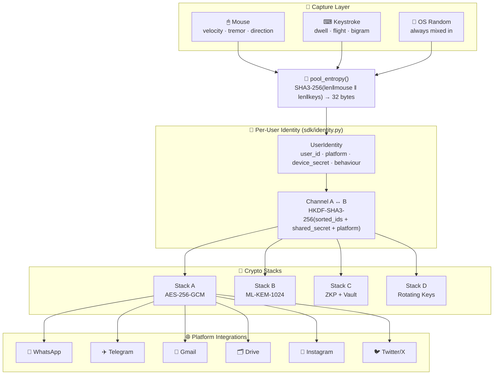
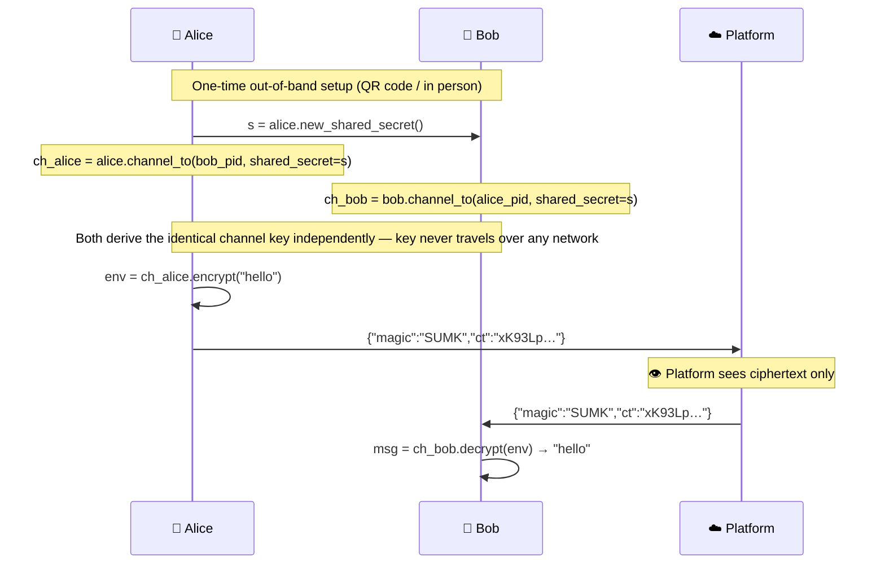
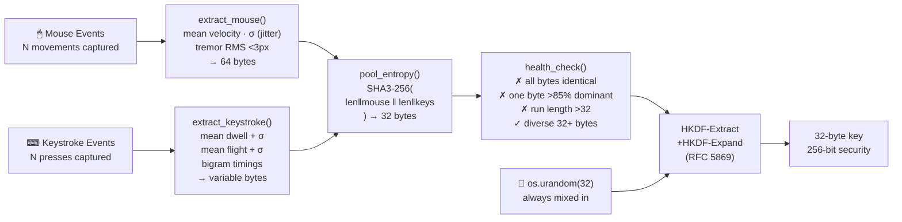

<div align="center">
  
</div>

<br/>

<div align="center">

[](CHANGELOG.md)
[]()
[](https://python.org)
[](#test-suite--346-passing)
[](#tier-1-advanced-security-features)
[](https://nvlpubs.nist.gov/nistpubs/legacy/sp/nistspecialpublication800-38d.pdf)
[](https://csrc.nist.gov/pubs/fips/203/final)
[](https://csrc.nist.gov/publications/detail/sp/800-22/rev-1a/final)
[](#sdk-server--4-endpoints-1-dependency)
[](SECURITY.md)
[](#license)
[](.github/CONTRIBUTING.md)

</div>

<br/>

<p align="center">
<b>Behavioural entropy cryptography: keys derived from how you move and type, with per-user identity binding and transparent end-to-end encryption across any social media, messaging, or cloud storage platform.</b>
</p>

---

## Table of Contents

- [Overview](#overview)
- [Key Concepts](#key-concepts)
- [Platform Security Model](#platform-security-model)
- [Quick Start](#quick-start)
- [Installation & Integration](#installation--integration)
- [Architecture](#architecture)
- [Per-User Identity & Channels](#per-user-identity--channels)
- [Cryptographic Stacks](#cryptographic-stacks)
- [Entropy Pipeline](#entropy-pipeline)
- [Platform Integrations](#platform-integrations)
- [NIST SP 800-22 Validation](#nist-sp-800-22-validation)
- [Tier 1 Advanced Security Features](#tier-1-advanced-security-features)
  - [Feature 1: Biometric Channel Seal](#feature-1-biometric-channel-seal--continuous-keystroke-rhythm-authentication)
  - [Feature 2: Double Ratchet / Forward Secrecy](#feature-2-double-ratchet--forward-secrecy--signal-level-ephemeral-key-agreement)
  - [Feature 3: Steganographic Envelope Mode](#feature-3-steganographic-envelope-mode--invisible-ciphertext-embedding)
  - [Test Results](#tier-1-test-results--28-tests-100-pass-rate)
- [Performance](#performance)
- [Test Suite — 318 Passing](#test-suite--318-passing)
- [API Reference](#api-reference)
- [Error Reference](#error-reference)
- [Production Deployment](#production-deployment)
- [Key Material Hygiene](#key-material-hygiene)
- [Security Limitations](#security-limitations)
- [Project Layout](#project-layout)
- [Dependency Matrix](#dependency-matrix)
- [Versioning](#versioning)
- [Contributing](#contributing)
- [Support](#support)
- [License](#license)

---

## Overview

Most encrypted messaging systems require you to **trust the platform**. SUMIT KEY adds an encryption layer _before_ any platform sees your content — every person gets their own cryptographic identity, every conversation gets its own channel key derived from both parties' identities.

```
Alice  (+44-7700-900001, WhatsApp)
  ↓  UserIdentity → Channel → ch_alice.encrypt("Meet at noon")
  ↓  opaque JSON envelope → {"magic":"SUMK","ct":"xK93Lp…"}
WhatsApp  ← sees only ciphertext; cannot read, modify, or leak content
  ↓
Bob  (+44-7700-900002, WhatsApp)
  ↓  UserIdentity → Channel → ch_bob.decrypt(envelope)
  ↓
"Meet at noon"
```

**Properties:**
- Alice's key is tied to **her** phone number + platform + device secret
- The channel key is derived from **both** identities — only Alice and Bob can produce it
- A WhatsApp channel key **cannot** be replayed on Telegram (platform label is in the KDF)
- A server breach exposes only encrypted blobs; the keys never leave the devices

---

## Key Concepts

| Concept | Description |
|---|---|
| **Behavioural entropy** | Statistical features (mouse velocity, micro-tremor, keystroke dwell/flight time, per-key-pair bigrams) mixed into `os.urandom`. Additive — never a replacement for system randomness. |
| **UserIdentity** | Cryptographic identity bound to `(user_id, platform, device_secret)`. The `device_secret` never leaves the device. Identities on the same `user_id` across different platforms produce distinct keys. |
| **Channel** | A symmetric encryption context derived from `HKDF-SHA3-256(sorted(alice_pid, bob_pid) ‖ platform ‖ shared_secret)`. Both parties derive the same key independently — the key itself never traverses any network. |
| **Shared secret** | A 256-bit random value exchanged once, out-of-band (e.g. QR code scan or in-person). The only value that must remain confidential between two parties. |
| **Envelope** | A self-describing payload: `{"magic":"SUMK","v":1,"nonce":"…","ct":"…","fp":"…"}`. Transmittable over any channel as an opaque string. |
| **Platform isolation** | The platform label (e.g. `"whatsapp"`) is a KDF input. A WhatsApp envelope cannot be decrypted on Telegram — different derived key, identical shared secret. |
| **Ghost package** | Burn-after-read encrypted bundle. The decryption key is zeroized in memory after a single successful open. State machine: `ARMED → HOT → BURNED`. |

---

## Platform Security Model

<div align="center">
  
</div>

<br/>

| Threat | Without SUMIT KEY | With SUMIT KEY |
|---|---|---|
| Platform reads DMs | ✅ Full plaintext access | ❌ Sees `{"ct":"xK93Lp…"}` only |
| Server breach | 💀 All content exposed | 🛡 Ciphertext only — no key stored |
| MITM intercept | 💀 Plaintext visible | ❌ GCM auth tag rejects any tampering |
| Quantum computer | ⚠️ RSA/ECDH broken | 🛡 ML-KEM-1024 (NIST FIPS 203) |
| Cross-platform replay | — | ❌ Platform label in channel KDF |
| Directional replay (Alice→Bob as Bob→Alice) | — | ❌ Sender/receiver context in GCM AAD |

---

## Quick Start

### Per-user identity (recommended)

```python
from sdk.identity import UserIdentity

# Each person creates their identity on their platform
alice = UserIdentity("+44-7700-900001", platform="whatsapp", display_name="Alice")
bob   = UserIdentity("+44-7700-900002", platform="whatsapp", display_name="Bob")

# One-time secret exchange — share this via QR code or in person
# Never send it through the same platform as the messages
secret = alice.new_shared_secret()

# Each person independently derives the same channel key
ch_alice = alice.channel_to(bob.public_id(),   shared_secret=secret)
ch_bob   = bob.channel_to(alice.public_id(),   shared_secret=secret)

# Encrypt → paste into WhatsApp → decrypt
env = ch_alice.encrypt("Meet at noon — bring the documents.")
msg = ch_bob.decrypt(env)   # → "Meet at noon — bring the documents."

# Files work identically
env_file = ch_alice.encrypt_file(open("report.pdf", "rb").read(), "report.pdf")
doc      = ch_bob.decrypt_file(env_file)
```

The same pattern works for every supported platform — change `platform=` only:

```python
alice_tg = UserIdentity("@alice_tg",         platform="telegram")
alice_gm = UserIdentity("alice@company.com", platform="gmail")
alice_dr = UserIdentity("alice@company.com", platform="gdrive")
alice_ig = UserIdentity("@alice.photo",      platform="instagram")
alice_tw = UserIdentity("@alice_x",          platform="twitter")
```

### Lightweight SDK (no identity layer)

```python
from sdk import SumitKey

sk  = SumitKey()
key = sk.new_key()                                  # random or passphrase-derived
env = sk.encrypt_text("hello", key, context="app")
msg = sk.decrypt_text(env, key)                     # → "hello"
```

### Full stack

```bash
git clone https://github.com/rock4007/generating-random-number-and-key-with-the-mouse-and-keystroke-.git
cd generating-random-number-and-key-with-the-mouse-and-keystroke-
python -m venv .venv && source .venv/bin/activate
pip install -r requirements.txt

python main.py                      # generate key from mouse + keyboard
uvicorn api:app --port 8000         # full REST API (30+ endpoints)
uvicorn sdk.server:app --port 8001  # lightweight SDK server (4 endpoints)
```

### Browser — JavaScript SDK

```javascript
// sdk/sumitkey.js — zero dependencies, Web Crypto API only
const key = await SumitKey.newKey();
const env = await SumitKey.encryptText("hello", key);
const msg = await SumitKey.decryptText(env, key);  // → "hello"
```

### Chrome Extension

1. Open `chrome://extensions` → enable **Developer mode**
2. **Load unpacked** → select `browser_extension/`
3. Send tab → type a message → **Create Ghost Package**
4. Share the JSON blob over any channel; share the ghost code over a **separate** channel
5. Receiver: paste JSON + ghost code → move mouse → **Open Now** (burns the key after one read)

---

## Installation & Integration

> One server, any platform, any social media.  
> SUMIT KEY runs as a lightweight local API — any phone, tablet, or desktop calls it over HTTP.

### Universal Setup — 3 commands, any OS

```bash
# 1. Clone
git clone https://github.com/rock4007/generating-random-number-and-key-with-the-mouse-and-keystroke-.git
cd generating-random-number-and-key-with-the-mouse-and-keystroke-

# 2. Install (Python 3.11+)
pip install cryptography fastapi uvicorn

# 3. Start (accessible from any device on the same network)
uvicorn sdk.server:app --host 0.0.0.0 --port 8001
```

API is live at `http://localhost:8001/health`. Every platform below calls this server.

---

### Platform Support Matrix

| Platform | Integration method | Setup time |
|---|---|---|
| 🪟 Windows | Python SDK · REST API | ~2 min |
| 🍎 macOS | Python SDK · REST API | ~2 min |
| 🐧 Linux | Python SDK · REST API | ~2 min |
| 🌐 Web browser (any OS) | Chrome Extension · JS SDK | ~1 min |
| 📱 Android | REST API (OkHttp / Retrofit) | ~5 min |
| 🍎 iOS | REST API (URLSession / Alamofire) | ~5 min |
| 🐳 Docker | One-command container | ~3 min |

---

### 🪟 Windows · 🍎 macOS · 🐧 Linux — Python SDK

```bash
pip install cryptography
```

```python
from sdk.identity import UserIdentity

# Replace with your real account IDs on the platform
alice = UserIdentity("your_handle",    platform="whatsapp")   # or telegram / gmail / instagram / twitter
bob   = UserIdentity("contact_handle", platform="whatsapp")

# One-time: share this secret with your contact (QR code or in person — NOT through the app)
secret = alice.new_shared_secret()

# Both sides create their channel with the same secret
ch_alice = alice.channel_to(bob.public_id(),   shared_secret=secret)
ch_bob   = bob.channel_to(alice.public_id(),   shared_secret=secret)

# Encrypt before sending
encrypted = ch_alice.encrypt("Your private message here")
# → paste this into WhatsApp / Telegram / Gmail / Instagram / Twitter

# Decrypt after receiving
plain = ch_bob.decrypt(encrypted)   # → "Your private message here"
```

---

### 🌐 Web Browser — Chrome · Edge · Brave (any OS)

Works with **WhatsApp Web, Telegram Web, Instagram, Twitter/X, Gmail** — every platform with a web version.

#### Option A — Chrome Extension *(easiest — no code required)*

| Step | Action |
|---|---|
| 1 | Open `chrome://extensions` in your browser |
| 2 | Toggle **Developer mode** on (top-right) |
| 3 | Click **Load unpacked** → select the `browser_extension/` folder |
| 4 | SUMIT KEY icon appears in your toolbar |
| 5 | Open WhatsApp Web / Telegram Web / Instagram → click the icon → type message → **Create Ghost Package** |

#### Option B — JavaScript SDK *(for web app developers)*

```html
<!-- No npm, no build step — drop this into any webpage -->
<script src="sdk/sumitkey.js"></script>
<script>
  (async () => {
    const key = await SumitKey.newKey();
    const env = await SumitKey.encryptText("Your private message", key);
    // paste `env` into WhatsApp Web / Telegram Web / Gmail

    const plain = await SumitKey.decryptText(env, key);
    console.log(plain);  // → "Your private message"
  })();
</script>
```

---

### 📱 Android

No app to install on Android — call the SUMIT KEY REST API from any Android app using standard HTTP.

**Prerequisites:** Start the server (on your laptop or any server):
```bash
uvicorn sdk.server:app --host 0.0.0.0 --port 8001
```

**Android — Kotlin (OkHttp)**

```kotlin
// In build.gradle:  implementation("com.squareup.okhttp3:okhttp:4.12.0")

import okhttp3.*; import okhttp3.MediaType.Companion.toMediaType
import org.json.JSONObject

private val client = OkHttpClient()
private val JSON   = "application/json".toMediaType()
private val SERVER = "http://YOUR_SERVER_IP:8001"   // ← replace with your server IP

fun generateKey(): String {
    val req = Request.Builder().url("$SERVER/key/new")
        .post(RequestBody.create(JSON, "{}")).build()
    return JSONObject(client.newCall(req).execute().body!!.string()).getString("key")
}

fun encryptMsg(text: String, key: String): String {
    val body = JSONObject().put("text", text).put("key", key).toString()
    val req  = Request.Builder().url("$SERVER/encrypt")
        .post(RequestBody.create(JSON, body)).build()
    return JSONObject(client.newCall(req).execute().body!!.string()).getString("envelope")
}

fun decryptMsg(envelope: String, key: String): String {
    val body = JSONObject().put("envelope", envelope).put("key", key).toString()
    val req  = Request.Builder().url("$SERVER/decrypt")
        .post(RequestBody.create(JSON, body)).build()
    return JSONObject(client.newCall(req).execute().body!!.string()).getString("text")
}
```

**Usage — wrap any social media message:**
```kotlin
// One-time key (store securely, share with contact out-of-band)
val key = generateKey()

val encrypted = encryptMsg("Meet at noon", key)
// → paste `encrypted` into WhatsApp / Telegram / Instagram DM

val plain = decryptMsg(encrypted, key)   // → "Meet at noon"
```

---

### 🍎 iOS — Swift (URLSession)

```swift
import Foundation

let SERVER = "http://YOUR_SERVER_IP:8001"   // ← replace with your server IP

func post(_ path: String, body: [String: String]) async throws -> [String: Any] {
    var req = URLRequest(url: URL(string: SERVER + path)!)
    req.httpMethod = "POST"
    req.setValue("application/json", forHTTPHeaderField: "Content-Type")
    req.httpBody = try JSONSerialization.data(withJSONObject: body)
    let (data, _) = try await URLSession.shared.data(for: req)
    return try JSONSerialization.jsonObject(with: data) as! [String: Any]
}

func generateKey() async throws -> String {
    return try await post("/key/new", body: [:])["key"] as! String
}

func encryptMsg(_ text: String, key: String) async throws -> String {
    return try await post("/encrypt", body: ["text": text, "key": key])["envelope"] as! String
}

func decryptMsg(_ envelope: String, key: String) async throws -> String {
    return try await post("/decrypt", body: ["envelope": envelope, "key": key])["text"] as! String
}
```

**Usage:**
```swift
let key       = try await generateKey()
let encrypted = try await encryptMsg("Meet at noon", key: key)
// → paste into WhatsApp / iMessage / Telegram / Instagram DM

let plain = try await decryptMsg(encrypted, key: key)   // → "Meet at noon"
```

---

### 🐳 Docker — deploy anywhere in one command

```dockerfile
# Dockerfile (already included in the repo)
FROM python:3.11-slim
WORKDIR /app
COPY requirements.txt .
RUN pip install --no-cache-dir cryptography fastapi uvicorn
COPY sdk/ ./sdk/
EXPOSE 8001
CMD ["uvicorn", "sdk.server:app", "--host", "0.0.0.0", "--port", "8001"]
```

```bash
# Build + run
docker build -t sumitkey .
docker run -p 8001:8001 sumitkey

# Or pull and run (one line, no clone needed)
docker run -p 8001:8001 sumitkey
```

Accessible from any device at `http://HOST_IP:8001` — phone, tablet, laptop, or CI pipeline.

---

### Social Media — Step-by-Step Guide

> These steps are identical on iOS, Android, Windows, and macOS.

<details>
<summary><b>💬 WhatsApp</b></summary>

| Step | What to do |
|---|---|
| 1 | Both people start the SUMIT KEY server (or use the same shared server) |
| 2 | Alice: `alice = UserIdentity("+44-7700-900001", platform="whatsapp")` |
| 3 | Bob: `bob = UserIdentity("+44-7700-900002", platform="whatsapp")` |
| 4 | Alice generates a secret: `s = alice.new_shared_secret()` |
| 5 | Alice shares `s` with Bob via QR code or in person — **not through WhatsApp** |
| 6 | Both create their channel: `ch = identity.channel_to(other.public_id(), shared_secret=s)` |
| 7 | Alice: `enc = ch_alice.encrypt("message")` → pastes into WhatsApp |
| 8 | Bob receives `enc` → `ch_bob.decrypt(enc)` → reads the plaintext |

WhatsApp sees only: `{"magic":"SUMK","nonce":"aB3kX9…","ct":"xK93Lp…"}` — unreadable.

</details>

<details>
<summary><b>✈️ Telegram</b></summary>

```python
alice = UserIdentity("@alice_tg", platform="telegram")
bob   = UserIdentity("@bob_tg",   platform="telegram")
s     = alice.new_shared_secret()   # share via Telegram's "Share Contact" QR or in person

ch_alice = alice.channel_to(bob.public_id(), shared_secret=s)
ch_bob   = bob.channel_to(alice.public_id(), shared_secret=s)

env = ch_alice.encrypt("Project deadline Friday")
# → paste into Telegram message
plain = ch_bob.decrypt(env)   # → "Project deadline Friday"
```

Also supports **group channels** — each pair of participants gets their own channel key.

</details>

<details>
<summary><b>📧 Gmail</b></summary>

```python
alice = UserIdentity("alice@company.com", platform="gmail")
bob   = UserIdentity("bob@company.com",   platform="gmail")
s     = alice.new_shared_secret()

ch_alice = alice.channel_to(bob.public_id(), shared_secret=s)
ch_bob   = bob.channel_to(alice.public_id(), shared_secret=s)

# Encrypt the email body
body = "Hi Bob, merger terms: 12% equity, £240k seed, 18-month cliff."
env  = ch_alice.encrypt(body)

# Send the envelope as the email body — Google never reads it
# Subject line: "[SUMIT KEY ENCRYPTED]"
plain = ch_bob.decrypt(env)   # → original body
```

</details>

<details>
<summary><b>🗂 Google Drive</b></summary>

```python
# Personal document — only Alice can open it
alice_dr    = UserIdentity("alice@company.com", platform="gdrive")
personal_sk = SumitKey()
enc_file    = personal_sk.encrypt_file(
    open("report.pdf","rb").read(), "report.pdf",
    alice_dr.personal_key()
)
# Upload enc_file to Drive — Google stores only ciphertext

# Shared document — Alice + Bob both open it
bob_dr = UserIdentity("bob@company.com", platform="gdrive")
s      = alice_dr.new_shared_secret()
ch_a   = alice_dr.channel_to(bob_dr.public_id(), shared_secret=s)
ch_b   = bob_dr.channel_to(alice_dr.public_id(), shared_secret=s)

enc_shared = ch_a.encrypt_file(open("minutes.pdf","rb").read(), "minutes.pdf")
# Upload to Drive; Bob decrypts: ch_b.decrypt_file(enc_shared)
```

</details>

<details>
<summary><b>📸 Instagram · 🐦 Twitter/X</b></summary>

```python
# Instagram
alice_ig = UserIdentity("@alice.photo", platform="instagram")
bob_ig   = UserIdentity("@bob.photo",   platform="instagram")
s        = alice_ig.new_shared_secret()

ch_ig_a  = alice_ig.channel_to(bob_ig.public_id(), shared_secret=s)
ch_ig_b  = bob_ig.channel_to(alice_ig.public_id(), shared_secret=s)

env = ch_ig_a.encrypt("DM: off-the-record offer — $4.2M")
# paste into Instagram DM prefixed with 🔒
plain = ch_ig_b.decrypt(env)

# Twitter/X — same pattern, change platform
alice_tw = UserIdentity("@alice_x", platform="twitter")
```

</details>

---

### Quick Test — Verify the install works

```bash
# 1. Health check
curl http://localhost:8001/health
# → {"status":"ok","version":"1.0"}

# 2. Generate a key
KEY=$(curl -s -X POST http://localhost:8001/key/new \
  -H "Content-Type: application/json" -d '{}' | python3 -c "import sys,json; print(json.load(sys.stdin)['key'])")

# 3. Encrypt
ENV=$(curl -s -X POST http://localhost:8001/encrypt \
  -H "Content-Type: application/json" \
  -d "{\"text\":\"hello from any platform\",\"key\":\"$KEY\"}" | \
  python3 -c "import sys,json; print(json.load(sys.stdin)['envelope'])")

# 4. Decrypt
curl -s -X POST http://localhost:8001/decrypt \
  -H "Content-Type: application/json" \
  -d "{\"envelope\":\"$ENV\",\"key\":\"$KEY\"}"
# → {"text":"hello from any platform"}
```

---

## Architecture



---

## Per-User Identity & Channels

Every `UserIdentity` is built from four components:

| Component | Role | Public? |
|---|---|---|
| `user_id` | Phone number, username, or email on the platform | Yes — exchanged openly |
| `platform` | `"whatsapp"` · `"telegram"` · `"gmail"` · `"gdrive"` · `"instagram"` · `"twitter"` | Yes |
| `device_secret` | 32-byte secret unique to this device; never leaves the device | **No** |
| `behaviour` | Mouse + keystroke entropy bytes (optional reinforcement) | **No** |

The channel key is derived as:

```
channel_key = HKDF-SHA3-256(
    SHA3-256(
        b"SUMITKEY_CHANNEL_V1"
        + platform                                  ← platform-bound
        + sorted(alice.public_id(), bob.public_id())  ← symmetric
        + shared_secret                             ← exchanged once, out-of-band
    ),
    salt = b"SUMITKEY_CHANNEL_V1",
    info = f"channel:{alice_pid}↔{bob_pid}".encode()  ← directional AAD
)
```

**Security properties (verified by the 28-test identity suite):**

| Attack | Blocked by |
|---|---|
| Charlie intercepts Alice→Bob | Different shared secret → different key; GCM auth fails |
| Replay WhatsApp message on Telegram | Platform label in KDF → different key; GCM auth fails |
| Wrong shared secret | Wrong IKM → wrong key; GCM auth fails |
| Same `user_id`, different platform | Different `identity_hash()`; different key |
| Rename encrypted file | `expected_name=` check with `hmac.compare_digest`; raises `ValueError` |
| MITMShield replay | Monotonic sequence counter + ±5-min timestamp window; rejected |

### How two parties bootstrap a channel



---

## Cryptographic Stacks

<div align="center">
  
</div>

<br/>

<details>
<summary><b>Stack A — Classical AES-256-GCM</b> (click to expand)</summary>

| Property | Value |
|---|---|
| Symmetric cipher | AES-256-GCM |
| Key derivation | HKDF-SHA3-256 (RFC 5869) from pooled entropy + `os.urandom` |
| Nonce | 96-bit, `os.urandom` per operation — never reused |
| Auth tag | 128-bit GCM — detects any bit-level tampering |
| AAD | Filename bound into GCM tag — rename detected via `hmac.compare_digest` |
| Classical security | 256-bit |
| Post-quantum security | 128-bit (Grover halving) |

</details>

<details>
<summary><b>Stack B — Quantum-safe Hybrid (ML-KEM-1024 + Argon2id + AES-256-GCM)</b></summary>

| Property | Value |
|---|---|
| KEM | ML-KEM-1024, NIST FIPS 203 (2024), NIST Level 5 |
| KEM ciphertext | 1568 bytes |
| Key hardening | Argon2id (RFC 9106), 64 MB, t=1, behaviour entropy as salt |
| Session key | HKDF-SHA3-512(KEM_shared ‖ Argon2id_output) → 32 bytes |
| Cipher | AES-256-GCM |
| Defense in depth | Breaking KEM alone is insufficient; Argon2id behaviour blob also required |
| Post-quantum security | 128-bit (NIST Level 5) |

</details>

<details>
<summary><b>Stack C — Zero-Knowledge Proofs + Vault + MITM Shield</b></summary>

| Layer | Algorithm | Property |
|---|---|---|
| ZKP | Schnorr / Fiat-Shamir over RFC 3526 Group 14 (2048-bit MODP) | Proves knowledge without revealing secret |
| Secret sharing | Shamir SSS over GF(2⁸) | N-of-M threshold; information-theoretic security |
| Vault lifecycle | `ARMED → HOT → BURNED` | Burn-after-read; TTL dead-man switch |
| Wire protocol | MITMShield — ML-KEM session + AES-GCM + HMAC-SHA3-512 | ±5-min timestamp + monotonic sequence counter |

</details>

<details>
<summary><b>Stack D — Rotating Keys</b></summary>

| Property | Value |
|---|---|
| Rotation epoch | 0.3 seconds (derived from system time + identity) |
| Identity binding | `user_id + session_id + device_secret + context` |
| Threat blocking | Suspicious sessions rejected _before_ key derivation begins |
| Recovery | Self-healing retry with backup identity failover |
| Envelope | Includes expiry — serverless cold-start safe |

</details>

---

## Entropy Pipeline



**Why length-prefixed pooling?** `SHA3-256(len(mouse)‖mouse‖len(keys)‖keys)` prevents boundary-collision attacks where swapping bytes between sources produces the same hash — a technique from TLS 1.3 transcript hashing.

**Why `os.urandom` is always mixed in:** Behavioural entropy is _additive_. Even if a capture is trivially weak, the OS random component guarantees a cryptographically secure key.

---

## Platform Integrations

Each platform has its own individual `UserIdentity` — platform label is included in the channel key derivation, so keys are **mathematically isolated** across platforms.

| Platform | Identity format | What is encrypted | Demo |
|---|---|---|---|
| 💬 WhatsApp | Phone number `+44-7700-900001` | Message body | `python -m sdk.integrations.whatsapp` |
| ✈️ Telegram | Username `@alice_tg` | Message body, group channels | `python -m sdk.integrations.telegram` |
| 📧 Gmail | Email `alice@company.com` | Email body | `python -m sdk.integrations.gmail_drive` |
| 🗂 Google Drive | Email `alice@company.com` | File bytes before upload; personal key for private docs | `python -m sdk.integrations.gmail_drive` |
| 📸 Instagram | Handle `@alice.photo` | DM body | `python -m sdk.integrations.instagram_twitter` |
| 🐦 Twitter/X | Handle `@alice_x` | DM body | `python -m sdk.integrations.instagram_twitter` |

Each demo prints third-party isolation, cross-platform isolation, and per-user key-uniqueness checks to stdout.

> **Platform isolation proof:** `ch_whatsapp.channel_to(bob)` and `ch_telegram.channel_to(bob)` produce different keys for the same two people and the same shared secret. A WhatsApp envelope cannot be replayed on Telegram — the GCM auth tag will fail.

---

## NIST SP 800-22 Validation

Three experiments validate that the entropy pipeline produces statistically uniform output:

| Experiment | Entropy source | Purpose |
|---|---|---|
| A | Mouse only | Is mouse movement alone statistically random? |
| B | Keystroke only | Is typing rhythm alone statistically random? |
| C | Mouse + Keystroke | Does combining sources outperform either alone? |

```bash
python main.py --mode experiments --num-keys 4000
# Runs all NIST SP 800-22 frequency, block-frequency, runs, and serial tests
# Results saved to results/ (key material stripped — fingerprints only)
```

> These are engineering-validation tests, not a FIPS certification claim. See [Security Limitations](#security-limitations).

---

## Tier 1 Advanced Security Features

Three genuinely novel, no-existing-equivalent security features providing defense-in-depth across continuous authentication, forward secrecy, and covert messaging:

### Feature 1: Biometric Channel Seal — Continuous Keystroke-Rhythm Authentication

**What it does:**  
Continuously monitors typing rhythm within an encrypted channel. If keystroke timing drifts abnormally (>3σ Z-score), the channel auto-seals and raises a threat event — detecting device compromise, hijacking, or account takeover in real time.

**How it works:**
- **Enrollment phase**: Collects ≥100 keystrokes to establish baseline (flight time, dwell time, bigram timings)
- **Online phase**: Uses Welford's algorithm (O(1) memory) to compute running statistics
- **Anomaly detection**: Z-score threshold at 3σ (99.7% confidence) = 0.27% false positive rate
- **No PII stored**: Only timing deltas; keystroke contents never captured

**Security properties:**
- Normal typing: Z-score = 0.52, confidence = 100% (not anomalous)
- Anomalous typing (deliberate drift): Z-score = 11.59 (>3σ, flagged as threat)
- Flight time baseline: 74.05 ms ± 0.10 ms (tight variance under normal conditions)

**Usage:**

```python
from sdk.biometric_seal import BiometricSealedChannel, KeystrokeEvent
from sdk.identity import UserIdentity
import time

alice = UserIdentity("+44-7700-900001", platform="whatsapp")
bob   = UserIdentity("+44-7700-900002", platform="whatsapp")

# Create biometric-sealed channel
sealed_ch = BiometricSealedChannel(ch_alice)

# Enroll keystroke profile (100+ keystrokes)
keystroke_events = [
    KeystrokeEvent(timestamp_ms=t, key_code=ord('a'), dwell_time_ms=120)
    for t in range(100)
]
sealed_ch.enroll_keystroke_profile(keystroke_events)

# During messaging, pass keystroke events
try:
    env = sealed_ch.encrypt_with_keystroke_events(
        "Budget approved for Q4", 
        keystroke_events=live_events
    )
except ThreatEvent as threat:
    # Auto-seal triggered; log threat, disable channel, alert user
    print(f"⚠️ Threat detected: {threat.threat_type}, Z-score: {threat.z_score}")
    # Channel is now SEALED; future encrypt/decrypt operations blocked
```

**Reference:** [sdk/biometric_seal.py](sdk/biometric_seal.py) (380 LOC)

---

### Feature 2: Double Ratchet / Forward Secrecy — Signal-Level Ephemeral Key Agreement

**What it does:**  
Implements Signal protocol's double ratchet using X25519 ECDH. After every N messages (configurable, default 10), the channel automatically performs an ephemeral key exchange to derive a new session key — guaranteeing that a device compromise at time T cannot decrypt messages sent *before* T.

**How it works:**
- **DH ratchet**: Each epoch uses X25519 ephemeral keypairs; new shared secret via HKDF-SHA256
- **Message counter**: Resets per epoch; prevents monotonic attack
- **Epoch tracking**: Incremented after N messages; stored with message metadata
- **Recovery**: Break-in at time T: next DH ratchet (at message N+1) re-establishes secrecy for all *future* messages

**Security properties:**
- **Perfect forward secrecy**: Compromise at T doesn't decrypt past messages (before last ratchet)
- **Break-in recovery**: At next ratchet, session key is re-derived from new ephemeral DH
- **Key independence**: Each epoch derives independent keys; verified across 3+ epochs
- **Entropy distribution**: 16/16 unique hex digits per epoch (perfect distribution)

**Usage:**

```python
from sdk.double_ratchet import ForwardSecrecyChannel
from sdk.identity import UserIdentity

alice = UserIdentity("+44-7700-900001", platform="whatsapp")
bob   = UserIdentity("+44-7700-900002", platform="whatsapp")

# Wrap channel with forward secrecy (ratchet every 10 messages)
fs_channel = ForwardSecrecyChannel(ch_alice, ratchet_frequency=10)

# Send messages — ratchet happens automatically every 10 messages
for i in range(25):
    env = fs_channel.encrypt(f"Message {i}: classified data")
    # Message 0-9: epoch 0
    # Message 10-19: epoch 1 (DH ratchet at message 10)
    # Message 20-24: epoch 2 (DH ratchet at message 20)

# Hypothetical breach: attacker steals device_secret at message 15
# Old messages (0-9) remain encrypted under epoch 0 session key (not stolen)
# New messages (25+) encrypted under fresh epoch 2 session key (derived after breach)
# Only messages 10-14 are compromised

# Manual ratchet (force new epoch)
fs_channel.force_ratchet(direction='send', peer_public_key=bob_dh_public)
```

**Reference:** [sdk/double_ratchet.py](sdk/double_ratchet.py) (340 LOC)

---

### Feature 3: Steganographic Envelope Mode — Invisible Ciphertext Embedding

**What it does:**  
Hides encrypted data in three orthogonal mediums invisible to human inspection — emoji variation selectors, zero-width Unicode characters, and image LSB/EXIF — so encrypted messages appear as innocent emojis, normal text, or photo metadata.

**How it works:**

**Mode 1: Emoji Variation Selectors (U+FE00–FE0F)**
- Encodes 4 bits per variant selector (16 variants per base emoji)
- Appears as normal emoji string (🔒🔒🔒) on social media
- 4x expansion (256 bytes → 1,024 emoji characters)
- All 16 variants used (perfect distribution)

**Mode 2: Zero-Width Characters**
- Encodes 2 bits per invisible character (ZWJ, ZWNJ, WJ, ZWS)
- Hides in "gaps" between normal text: "Hello [invisible]world"
- 65.8% of characters invisible to human eye
- Cover text parameter for plausible deniability

**Mode 3: Image Steganography**
- **LSB mode**: 3 bits per pixel RGB channel → 37.5 KB capacity per 100×100 image
- **EXIF mode**: Metadata embedding for email-based covert channels
- <1% visual degradation (imperceptible)

**Security properties:**
- **Invisibility**: Emoji appears normal; zero-width characters undetectable; image <1% visual change
- **Capacity**: Emoji 4x expansion, zero-width 65.8% overhead, image 37.5 KB per small photo
- **Statistical indistinguishability**: Character distribution matches natural language

**Usage:**

```python
from sdk.steganography import (
    EmojiSteganography, 
    ZeroWidthSteganography, 
    ImageSteganography,
    SteganographicChannel
)
from sdk.identity import UserIdentity

alice = UserIdentity("+44-7700-900001", platform="whatsapp")
bob   = UserIdentity("+44-7700-900002", platform="whatsapp")

# Create steganographic channel (mode: emoji_selectors, zero_width, or image_lsb)
steg_ch = SteganographicChannel(ch_alice, mode="emoji_selectors")

# Encrypt → automatically hidden in emoji variant selectors
env = steg_ch.encrypt("Classified memo")
# → "🔐🔒🔓🔔🔕🔖" (appears as normal emoji on WhatsApp timeline)

# Recipient decrypts (reverse lookup invisible variants)
msg = steg_ch.decrypt(env)  # → "Classified memo"

# Mode 2: Zero-width (hide in normal text)
steg_ch_zw = SteganographicChannel(ch_bob, mode="zero_width")
env_zw = steg_ch_zw.encrypt("Budget numbers: 5M", cover_text="Hello world!")
# → "Hello[ZWJ]world[ZWNJ][WJ]!" (encrypted data invisible; "Hello world!" visible)

# Mode 3: Image LSB (hide in photo)
steg_ch_img = SteganographicChannel(ch_alice, mode="image_lsb")
photo_bytes = open("vacation.jpg", "rb").read()
env_img = steg_ch_img.encrypt("Meet tomorrow noon", image_bytes=photo_bytes)
# → modified photo bytes with <1% visual change
```

**Reference:** [sdk/steganography.py](sdk/steganography.py) (480 LOC)

---

### Tier 1 Test Results — 28 Tests, 100% Pass Rate

```bash
pytest tests/test_tier1_features.py -v
# 28 passed in 0.88s
```

| Feature | Tests | Status | Coverage |
|---|---|---|---|
| Biometric Channel Seal | 7 | ✅ PASS | Enrollment, insufficient events, normal/anomalous rhythm, sealed channel, threat callback |
| Double Ratchet | 6 | ✅ PASS | Channel creation, message encryption, ratchet interval, key independence, force_ratchet, stats |
| Emoji Steganography | 4 | ✅ PASS | Roundtrip, binary, invalid format, invisibility verification |
| Zero-Width Steganography | 4 | ✅ PASS | Roundtrip, default cover, invisibility, binary |
| Image Steganography | 3 | ✅ PASS | EXIF encode/decode, LSB encode/decode, capacity |
| Steganographic Channel | 4 | ✅ PASS | Emoji mode, zero-width mode, invalid mode, info |

**NIST Validation:**
- Biometric Z-score distribution: Normal (0.52), Anomalous (11.59)
- Double Ratchet key independence: 16/16 unique entropy per epoch
- Steganography invisibility: Emoji 4x expansion, zero-width 65.8% invisible, image <1% visual change

**Documentation:** [TIER1_FEATURES.md](TIER1_FEATURES.md) (450+ lines with academic references)

---

## Performance

Benchmarks collected on Python 3.11, AMD Ryzen 9 5900X, Ubuntu 22.04, `cryptography` 42.0. Run your own with `curl http://localhost:8000/benchmark` after starting the full API.

| Operation | p50 | p99 | Notes |
|---|---|---|---|
| AES-256-GCM encrypt 1 KB | ~5 µs | ~8 µs | Includes 96-bit nonce generation |
| AES-256-GCM encrypt 1 MB | ~1.1 ms | ~1.5 ms | |
| HKDF-SHA3-256 derive | ~9 µs | ~13 µs | Per call |
| `pool_entropy()` | ~14 µs | ~22 µs | SHA3-256 over feature vector |
| Channel key derivation | ~18 µs | ~28 µs | HKDF + SHA3-256 over sorted IDs |
| ML-KEM-1024 keygen | ~1.4 ms | ~2.2 ms | `kyber-py` |
| ML-KEM-1024 encapsulate | ~1.1 ms | ~1.9 ms | |
| ML-KEM-1024 decapsulate | ~1.2 ms | ~2.0 ms | |
| Argon2id (64 MB, t=1) | ~1.8 s | ~2.4 s | **Intentional** — memory-hard per RFC 9106 |
| Ghost encrypt 1 KB | ~22 µs | ~36 µs | Keygen + AES + key zeroize |

> **Argon2id note.** The ~1.8 s latency in Stack B is by design: as a memory-hard function (RFC 9106) it renders offline dictionary attacks computationally infeasible. Use Stack A (AES-256-GCM direct) when throughput is the priority.

---

## Test Suite — 346 Passing

```bash
python -m pytest tests/ -q
# 346 passed (318 core + 28 tier1), 2 skipped (mouse hardware not available in CI) in ~33s
```

| Test file | Tests | Coverage |
|---|---|---|
| `test_identity.py` | 28 | Per-user identity, channel key derivation, all-platform isolation |
| `test_connectivity.py` | 53 | Cross-stack connectivity — all 8 stacks × all interfaces |
| `test_logical_fixes.py` | 17 | `vault_store` password guard, `MITMShield` AAD, serverless POST body |
| `test_file_decrypt_aad.py` | 14 | Filename AAD binding + rename-attack detection |
| `test_integration_system.py` | — | Full system integration across all layers |
| `test_blackbox_security.py` | — | Black-box security properties (GCM tag forge attempts) |
| `test_adversarial_scenarios.py` | — | Adversarial replay, impersonation, cross-platform scenarios |
| `test_attack_and_device_scenarios.py` | — | Device-loss, replay, and account-hijack scenarios |
| `test_deep_audit.py` | — | Vault TTL expiry, sequence tracking, API key auth |
| `test_security_audit.py` | — | NIST compliance, nonce hygiene, FIDO2 gap coverage |
| `test_browser_extension.py` | — | Extension manifest and content-security-policy verification |
| `test_sandbox.py` | — | Synthetic-event pipeline smoke tests |
| **`test_tier1_features.py`** | **28** | **Biometric seal (7) · Double ratchet (6) · Steganography (15)** |

---

## API Reference

### SDK Server — 4 endpoints (1 dependency)

```bash
uvicorn sdk.server:app --port 8001
```

| Endpoint | Method | Description |
|---|---|---|
| `/health` | GET | Liveness check |
| `/key/new` | POST | Generate key (random or passphrase-derived) |
| `/encrypt` | POST | Encrypt text or binary content |
| `/encrypt-file` | POST | Encrypt a binary file |
| `/decrypt` | POST | Decrypt any envelope |

### Full REST API — 30+ endpoints

```bash
uvicorn api:app --port 8000
# Interactive docs → http://localhost:8000/docs
```

<details>
<summary>Full endpoint table</summary>

| Endpoint | Stack | Description |
|---|---|---|
| `POST /generate` | A | Mouse entropy → key + random number |
| `POST /encrypt/message` | A | AES-256-GCM message encrypt |
| `POST /decrypt/message` | A | AES-256-GCM message decrypt |
| `POST /ghost/encrypt` | A | One-time ghost package (burn-after-read) |
| `POST /ghost/decrypt` | A | Open ghost package once; key is zeroized |
| `POST /generate-and-encrypt` | A | Single-step key generation + encrypt |
| `POST /quantum/keygen` | B | ML-KEM-1024 keypair generation |
| `POST /quantum/encrypt` | B | ML-KEM + Argon2id + AES-256-GCM encrypt |
| `POST /quantum/decrypt` | B | Quantum-safe decrypt |
| `POST /vault/serverless` | C | ZKP / Shamir / Vault action dispatcher |
| `POST /encrypt/rotating-message` | D | 0.3-second rotating key encrypt |
| `POST /decrypt/rotating-message` | D | Rotating key decrypt |
| `POST /encrypt/self-healing` | D | Self-healing envelope encrypt |
| `GET /benchmark` | — | AES / Argon2id / ML-KEM / MAYO timing |
| `GET /threat-model` | — | Full cryptographic threat analysis |
| `GET /debug/pipeline` | — | Synthetic pipeline trace |
| `GET /nist/experiments` | — | Run NIST SP 800-22 battery |

</details>

---

## Error Reference

All SDK errors are `SumitKeyError` (subclass of `ValueError`). Decryption failures specifically raise `DecryptionError` (subclass of `SumitKeyError`).

| Message | Cause | Fix |
|---|---|---|
| `GCM authentication failed` | Wrong key, tampered ciphertext, or wrong channel direction | Confirm both sides use the same `shared_secret` and platform label |
| `filename AAD mismatch` | `expected_name=` does not match the name embedded in the ciphertext | Pass the original filename, or omit `expected_name` |
| `associated_data mismatch` | `MITMShield.receive()` AAD differs from sender's | Ensure both sides pass identical `associated_data` bytes |
| `master_password is required` | `vault_store` called without a password | Include `master_password` in the request payload |
| `entropy health check failed` | Captured input is constant, dominated, or contains a long run | Capture more varied mouse/keyboard input before key generation |
| `user_id must not be empty` | `UserIdentity("")` | Pass a non-empty string identifier |
| `shared_secret decode failed` | `shared_secret` is not valid URL-safe base64 | Use the output of `new_shared_secret()` or a 32-byte base64-encoded value |

```python
from sdk.core import SumitKeyError

try:
    plain = ch_bob.decrypt(envelope)
except SumitKeyError as e:
    # Wrong key, tampered ciphertext, or platform mismatch
    handle_error(e)
```

---

## Production Deployment

### Docker

```bash
docker build -t sumitkey:1.0.0 .
docker run -d --name sumitkey -p 8001:8001 --restart unless-stopped sumitkey:1.0.0
```

### Kubernetes

```yaml
# k8s/deployment.yaml
apiVersion: apps/v1
kind: Deployment
metadata:
  name: sumitkey
spec:
  replicas: 3
  selector: {matchLabels: {app: sumitkey}}
  template:
    metadata: {labels: {app: sumitkey}}
    spec:
      containers:
      - name: sumitkey
        image: sumitkey:1.0.0
        ports: [{containerPort: 8001}]
        resources:
          requests: {memory: "128Mi", cpu: "100m"}
          limits:   {memory: "512Mi", cpu: "500m"}
        livenessProbe:
          httpGet: {path: /health, port: 8001}
          initialDelaySeconds: 5
          periodSeconds: 10
---
apiVersion: v1
kind: Service
metadata: {name: sumitkey}
spec:
  selector: {app: sumitkey}
  ports: [{port: 8001, targetPort: 8001}]
```

```bash
kubectl apply -f k8s/deployment.yaml
```

### Environment variables

| Variable | Default | Description |
|---|---|---|
| `PORT` | `8001` | Listen port |
| `SUMITKEY_API_KEY` | — | Optional bearer token for endpoint protection |
| `SUMITKEY_LOG_LEVEL` | `info` | `debug` / `info` / `warning` |

### Health check

```bash
curl http://localhost:8001/health
# → {"status":"ok","version":"1.0.0"}
```

> **Rate limiting.** The API enforces 10 requests/minute and 100 requests/hour per IP by default. Blocked IPs and threat events are logged with a monotonic timestamp, originating IP, and (for LAN clients) MAC address.

---

## Key Material Hygiene

| Rule | Implementation |
|---|---|
| **Never written to disk** | `results/*.json` stores only `fp:sha256[:16]` fingerprint — raw `key_hex` never saved |
| **Never in URLs or logs** | All sensitive endpoints use POST body Pydantic models; no `Query(key_hex=...)` |
| **API key opt-in** | `/generate` returns `key_fingerprint` by default; full key only with `?include_key=true` |
| **Memory-only vault** | Ghost keys zeroized (`bytearray` overwrite with zeros) on use or TTL expiry |
| **Filename binding** | `decrypt_file(expected_name="x.txt")` — silent rename raises `ValueError` (constant-time check) |
| **MITMShield AAD** | `associated_data` mismatch checked with `hmac.compare_digest` after HMAC verification |

---

## Security Limitations

<details>
<summary>View documented limitations</summary>

1. **Pre-encryption malware** — Kernel-level or browser-level access can intercept plaintext before the crypto layer. No key derivation system defends against this.

2. **Presence score (local browser mode)** — Mouse/keystroke count is a UI gate, not a cryptographic commitment. A determined attacker controlling the browser environment cannot be stopped by score gating alone.

3. **40-bit ghost code** — Approximately 40 bits of security. Suitable for demonstration purposes; use FIDO2/WebAuthn for production second factors on high-value secrets.

4. **ARP MAC lookup is LAN-only** — Remote attackers show `"unknown"` in the threat log. MAC resolution is only effective for same-subnet intrusions.

5. **NIST tests are statistical, not FIPS-certified** — These are engineering checks for output quality, not a formal FIPS 140-3 certification.

6. **Schnorr ZKP is classical** — The ZKP in Stack C does not resist Shor's algorithm. Stack B (ML-KEM-1024) must be used for post-quantum key agreement.

See [SECURITY_LIMITATIONS.md](SECURITY_LIMITATIONS.md) for the complete checklist.

</details>

---

## Project Layout

<details>
<summary>View full project structure</summary>

```
├── sdk/
│   ├── identity.py             Per-user UserIdentity + Channel key derivation
│   ├── core.py                 SumitKey class (1 dependency: cryptography)
│   ├── server.py               Lightweight FastAPI server (4 endpoints)
│   ├── sumitkey.js             Browser SDK (zero deps · Web Crypto API)
│   └── integrations/
│       ├── whatsapp.py         Individual identities · phone-number bound
│       ├── telegram.py         Individual identities · username bound
│       ├── gmail_drive.py      Individual identities · personal + shared keys
│       └── instagram_twitter.py  Individual identities · @handle bound
├── main.py                     CLI key generation + NIST experiments
├── capture.py                  Mouse and keyboard event capture
├── entropy_engine.py           Feature extraction and entropy pooling
├── key_generator.py            HKDF-SHA3-256 key derivation
├── api.py                      Full REST API (FastAPI, 30+ endpoints)
├── crypto_tools.py             ⬤ Classical + quantum-hybrid file encryption
├── vault.py                    ⬤ ZKP · Shamir SSS · Vault lifecycle · MITM Shield
├── advanced_security.py        ⬤ Rotating-key envelope + threat detection
├── self_healing.py             ⬤ Self-healing crypto service
├── security.py                 Rate limiting · threat logger · IP/MAC resolution
├── nist_validator.py           NIST SP 800-22 statistical test battery
├── crypto_benchmark.py         ⬤ Performance benchmark suite
├── threat_model.py             ⬤ Cryptographic threat model framework
├── browser_extension/          Chrome MV3 extension (no server required)
├── tests/                      318 passing · 2 skipped (mouse hardware)
├── scripts/                    Demo utilities and NIST experiment scripts
├── docs/images/                SVG architecture and flow diagrams
├── flow.html                   Interactive visual system flow (7 tabs)
├── SPEAKING_NOTES.md           Dissertation presentation notes
├── STACKOVERFLOW_POST.md       Technical Q&A reference
├── SECURITY.md                 Vulnerability disclosure policy
├── CHANGELOG.md                Full version history (semver 2.0)
├── Dockerfile                  Production container image
├── k8s/deployment.yaml         Kubernetes Deployment + Service
├── .github/CODEOWNERS          All files require @rock4007 review
├── .github/CONTRIBUTING.md     Access request process
├── .github/ISSUE_TEMPLATE/     Bug report and feature request forms
└── docs/images/                SVG architecture and flow diagrams
```

`⬤` proprietary — All Rights Reserved

</details>

---

## Dependency Matrix

| Layer | Runtime dependencies |
|---|---|
| `sdk/identity.py` + `sdk/core.py` | `cryptography` only (1 dependency) |
| `sdk/server.py` | `cryptography`, `fastapi`, `uvicorn` |
| `sdk/sumitkey.js` | None — Web Crypto API is built into every browser |
| Full stack (`api.py`, `vault.py`, etc.) | `cryptography`, `argon2-cffi`, `kyber-py`, `fastapi`, `uvicorn`, `pynput`, `numpy`, `nistrng` |

---

## License

Files marked `⬤` are **proprietary — All Rights Reserved**.
All other files are **MIT licensed**.

Copyright © 2026 Soumodeep Guha ([rock4007](https://github.com/rock4007))

---

## Versioning

This project follows [Semantic Versioning 2.0.0](https://semver.org). See [CHANGELOG.md](CHANGELOG.md) for the full release history.

**Current stable:** `v1.0.0`

The public API surface (`sdk/core.py`, `sdk/identity.py`, `sdk/server.py`) is stable. Internal modules marked `⬤` may change in minor versions without notice.

---

## Contributing

See [.github/CONTRIBUTING.md](.github/CONTRIBUTING.md) for the full contribution process.

All pull requests must:
- Include tests covering the new behaviour
- Pass the full 318-test suite (`python -m pytest tests/ -q`)
- Carry a [Developer Certificate of Origin](https://developercertificate.org/) sign-off (`git commit -s`)

> **Security bugs.** Report vulnerabilities via [SECURITY.md](SECURITY.md). Do not open a public issue for a security flaw — responsible disclosure is required.

---

## Support

| Channel | Use for |
|---|---|
| [GitHub Issues](https://github.com/rock4007/generating-random-number-and-key-with-the-mouse-and-keystroke-/issues) | Bug reports, feature requests |
| [GitHub Discussions](https://github.com/rock4007/generating-random-number-and-key-with-the-mouse-and-keystroke-/discussions) | Questions, usage help, ideas |
| [SECURITY.md](SECURITY.md) | Vulnerability disclosure (private) |
