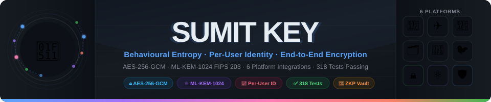
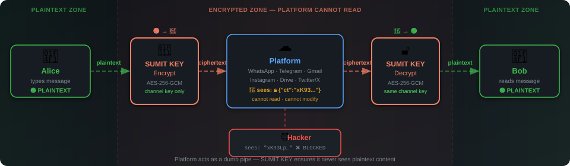
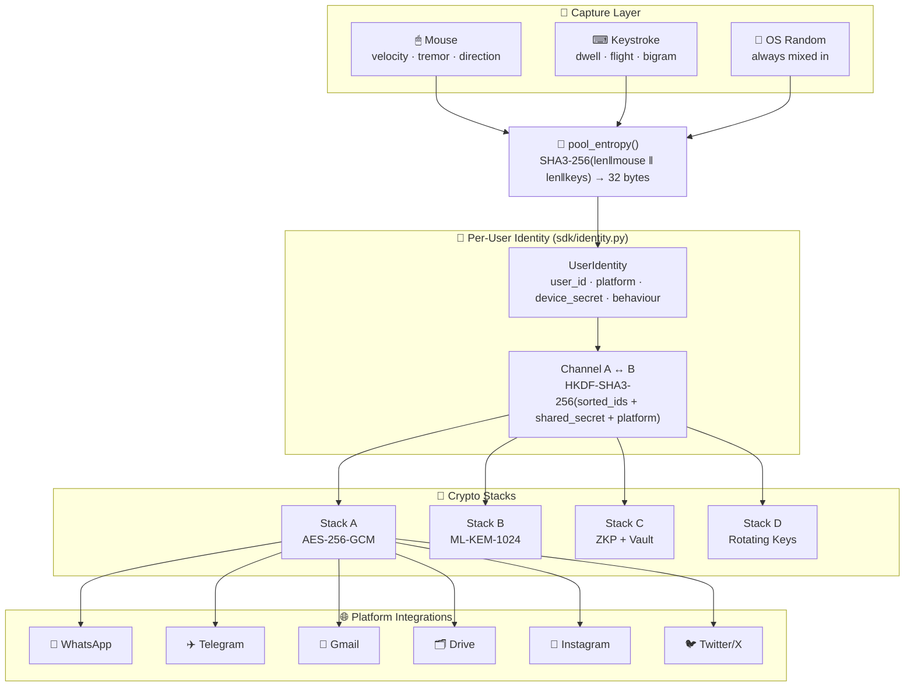
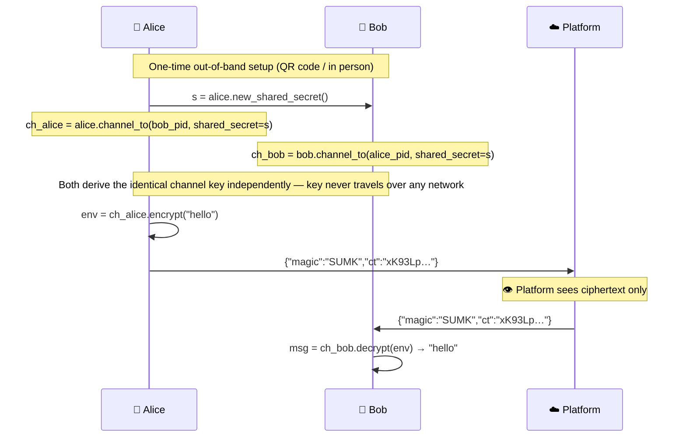
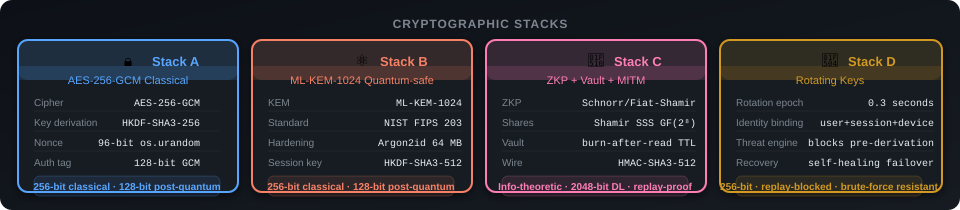
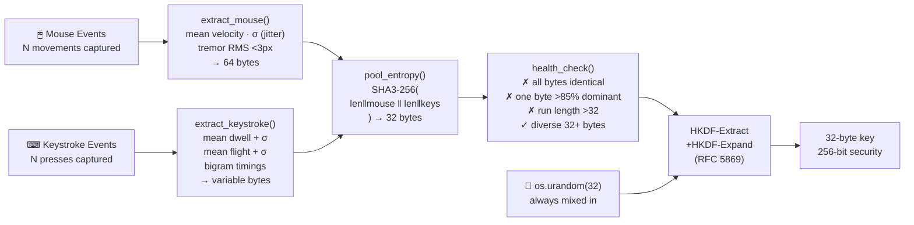

<div align="center">
  
</div>

<br/>

<div align="center">

[](https://python.org)
[](#test-suite--318-passing)
[](https://en.wikipedia.org/wiki/Galois/Counter_Mode)
[](https://csrc.nist.gov/pubs/fips/203/final)
[](#platform-integrations)
[](#quick-start--lightweight-sdk)
[](#quick-start--chrome-extension)
[](#nist-sp-800-22-validation)
[](#license)

</div>

<br/>

<p align="center">
<b>Cryptographic key generation from how you move and type — with a complete per-user identity layer and encryption that sits in front of any social media, messaging, or cloud storage platform.</b>
</p>

---

## Table of Contents

- [Overview](#overview)
- [Platform Security Model](#platform-security-model)
- [Quick Start](#quick-start)
- [Architecture](#architecture)
- [Per-User Identity & Channels](#per-user-identity--channels)
- [Cryptographic Stacks](#cryptographic-stacks)
- [Entropy Pipeline](#entropy-pipeline)
- [Platform Integrations](#platform-integrations)
- [NIST SP 800-22 Validation](#nist-sp-800-22-validation)
- [Test Suite — 318 Passing](#test-suite--318-passing)
- [API Reference](#api-reference)
- [Key Material Hygiene](#key-material-hygiene)
- [Security Limitations](#security-limitations)
- [Project Layout](#project-layout)
- [Dependency Matrix](#dependency-matrix)
- [License](#license)

---

## Overview

Most encrypted messaging systems require you to **trust the platform**. SUMIT KEY adds an encryption layer _before_ any platform sees your content — every person gets their own cryptographic identity, every conversation gets its own channel key derived from both parties' identities.

```
Alice  (+44-7700-900001, WhatsApp)
  ↓  UserIdentity → Channel → ch_alice.encrypt("Meet at noon")
  ↓  opaque JSON envelope → {"magic":"SUMK","ct":"xK93Lp…"}
WhatsApp  ← sees only ciphertext; cannot read, modify, or leak content
  ↓
Bob  (+44-7700-900002, WhatsApp)
  ↓  UserIdentity → Channel → ch_bob.decrypt(envelope)
  ↓
"Meet at noon"
```

**Properties:**
- Alice's key is tied to **her** phone number + platform + device secret
- The channel key is derived from **both** identities — only Alice and Bob can produce it
- A WhatsApp channel key **cannot** be replayed on Telegram (platform label is in the KDF)
- A server breach exposes only encrypted blobs; the keys never leave the devices

---

## Platform Security Model

<div align="center">
  
</div>

<br/>

| Threat | Without SUMIT KEY | With SUMIT KEY |
|---|---|---|
| Platform reads DMs | ✅ Full plaintext access | ❌ Sees `{"ct":"xK93Lp…"}` only |
| Server breach | 💀 All content exposed | 🛡 Ciphertext only — no key stored |
| MITM intercept | 💀 Plaintext visible | ❌ GCM auth tag rejects any tampering |
| Quantum computer | ⚠️ RSA/ECDH broken | 🛡 ML-KEM-1024 (NIST FIPS 203) |
| Cross-platform replay | — | ❌ Platform label in channel KDF |
| Directional replay (Alice→Bob as Bob→Alice) | — | ❌ Sender/receiver context in GCM AAD |

---

## Quick Start

### Per-user identity (recommended)

```python
from sdk.identity import UserIdentity

# Each person creates their identity on their platform
alice = UserIdentity("+44-7700-900001", platform="whatsapp", display_name="Alice")
bob   = UserIdentity("+44-7700-900002", platform="whatsapp", display_name="Bob")

# One-time secret exchange — share this via QR code or in person
# Never send it through the same platform as the messages
secret = alice.new_shared_secret()

# Each person independently derives the same channel key
ch_alice = alice.channel_to(bob.public_id(),   shared_secret=secret)
ch_bob   = bob.channel_to(alice.public_id(),   shared_secret=secret)

# Encrypt → paste into WhatsApp → decrypt
env = ch_alice.encrypt("Meet at noon — bring the documents.")
msg = ch_bob.decrypt(env)   # → "Meet at noon — bring the documents."

# Files work identically
env_file = ch_alice.encrypt_file(open("report.pdf", "rb").read(), "report.pdf")
doc      = ch_bob.decrypt_file(env_file)
```

The same pattern works for every supported platform — change `platform=` only:

```python
alice_tg = UserIdentity("@alice_tg",         platform="telegram")
alice_gm = UserIdentity("alice@company.com", platform="gmail")
alice_dr = UserIdentity("alice@company.com", platform="gdrive")
alice_ig = UserIdentity("@alice.photo",      platform="instagram")
alice_tw = UserIdentity("@alice_x",          platform="twitter")
```

### Lightweight SDK (no identity layer)

```python
from sdk import SumitKey

sk  = SumitKey()
key = sk.new_key()                                  # random or passphrase-derived
env = sk.encrypt_text("hello", key, context="app")
msg = sk.decrypt_text(env, key)                     # → "hello"
```

### Full stack

```bash
git clone https://github.com/rock4007/generating-random-number-and-key-with-the-mouse-and-keystroke-.git
cd generating-random-number-and-key-with-the-mouse-and-keystroke-
python -m venv .venv && source .venv/bin/activate
pip install -r requirements.txt

python main.py                      # generate key from mouse + keyboard
uvicorn api:app --port 8000         # full REST API (30+ endpoints)
uvicorn sdk.server:app --port 8001  # lightweight SDK server (4 endpoints)
```

### Browser — JavaScript SDK

```javascript
// sdk/sumitkey.js — zero dependencies, Web Crypto API only
const key = await SumitKey.newKey();
const env = await SumitKey.encryptText("hello", key);
const msg = await SumitKey.decryptText(env, key);  // → "hello"
```

### Chrome Extension

1. Open `chrome://extensions` → enable **Developer mode**
2. **Load unpacked** → select `browser_extension/`
3. Send tab → type a message → **Create Ghost Package**
4. Share the JSON blob over any channel; share the ghost code over a **separate** channel
5. Receiver: paste JSON + ghost code → move mouse → **Open Now** (burns the key after one read)

---

## Architecture



---

## Per-User Identity & Channels

Every `UserIdentity` is built from four components:

| Component | Role | Public? |
|---|---|---|
| `user_id` | Phone number, username, or email on the platform | Yes — exchanged openly |
| `platform` | `"whatsapp"` · `"telegram"` · `"gmail"` · `"gdrive"` · `"instagram"` · `"twitter"` | Yes |
| `device_secret` | 32-byte secret unique to this device; never leaves the device | **No** |
| `behaviour` | Mouse + keystroke entropy bytes (optional reinforcement) | **No** |

The channel key is derived as:

```
channel_key = HKDF-SHA3-256(
    SHA3-256(
        b"SUMITKEY_CHANNEL_V1"
        + platform                                  ← platform-bound
        + sorted(alice.public_id(), bob.public_id())  ← symmetric
        + shared_secret                             ← exchanged once, out-of-band
    ),
    salt = b"SUMITKEY_CHANNEL_V1",
    info = f"channel:{alice_pid}↔{bob_pid}".encode()  ← directional AAD
)
```

**Security properties (verified by the 28-test identity suite):**

| Attack | Blocked by |
|---|---|
| Charlie intercepts Alice→Bob | Different shared secret → different key; GCM auth fails |
| Replay WhatsApp message on Telegram | Platform label in KDF → different key; GCM auth fails |
| Wrong shared secret | Wrong IKM → wrong key; GCM auth fails |
| Same `user_id`, different platform | Different `identity_hash()`; different key |
| Rename encrypted file | `expected_name=` check with `hmac.compare_digest`; raises `ValueError` |
| MITMShield replay | Monotonic sequence counter + ±5-min timestamp window; rejected |

### How two parties bootstrap a channel



---

## Cryptographic Stacks

<div align="center">
  
</div>

<br/>

<details>
<summary><b>Stack A — Classical AES-256-GCM</b> (click to expand)</summary>

| Property | Value |
|---|---|
| Symmetric cipher | AES-256-GCM |
| Key derivation | HKDF-SHA3-256 (RFC 5869) from pooled entropy + `os.urandom` |
| Nonce | 96-bit, `os.urandom` per operation — never reused |
| Auth tag | 128-bit GCM — detects any bit-level tampering |
| AAD | Filename bound into GCM tag — rename detected via `hmac.compare_digest` |
| Classical security | 256-bit |
| Post-quantum security | 128-bit (Grover halving) |

</details>

<details>
<summary><b>Stack B — Quantum-safe Hybrid (ML-KEM-1024 + Argon2id + AES-256-GCM)</b></summary>

| Property | Value |
|---|---|
| KEM | ML-KEM-1024, NIST FIPS 203 (2024), NIST Level 5 |
| KEM ciphertext | 1568 bytes |
| Key hardening | Argon2id (RFC 9106), 64 MB, t=1, behaviour entropy as salt |
| Session key | HKDF-SHA3-512(KEM_shared ‖ Argon2id_output) → 32 bytes |
| Cipher | AES-256-GCM |
| Defense in depth | Breaking KEM alone is insufficient; Argon2id behaviour blob also required |
| Post-quantum security | 128-bit (NIST Level 5) |

</details>

<details>
<summary><b>Stack C — Zero-Knowledge Proofs + Vault + MITM Shield</b></summary>

| Layer | Algorithm | Property |
|---|---|---|
| ZKP | Schnorr / Fiat-Shamir over RFC 3526 Group 14 (2048-bit MODP) | Proves knowledge without revealing secret |
| Secret sharing | Shamir SSS over GF(2⁸) | N-of-M threshold; information-theoretic security |
| Vault lifecycle | `ARMED → HOT → BURNED` | Burn-after-read; TTL dead-man switch |
| Wire protocol | MITMShield — ML-KEM session + AES-GCM + HMAC-SHA3-512 | ±5-min timestamp + monotonic sequence counter |

</details>

<details>
<summary><b>Stack D — Rotating Keys</b></summary>

| Property | Value |
|---|---|
| Rotation epoch | 0.3 seconds (derived from system time + identity) |
| Identity binding | `user_id + session_id + device_secret + context` |
| Threat blocking | Suspicious sessions rejected _before_ key derivation begins |
| Recovery | Self-healing retry with backup identity failover |
| Envelope | Includes expiry — serverless cold-start safe |

</details>

---

## Entropy Pipeline



**Why length-prefixed pooling?** `SHA3-256(len(mouse)‖mouse‖len(keys)‖keys)` prevents boundary-collision attacks where swapping bytes between sources produces the same hash — a technique from TLS 1.3 transcript hashing.

**Why `os.urandom` is always mixed in:** Behavioural entropy is _additive_. Even if a capture is trivially weak, the OS random component guarantees a cryptographically secure key.

---

## Platform Integrations

Each platform has its own individual `UserIdentity` — platform label is included in the channel key derivation, so keys are **mathematically isolated** across platforms.

| Platform | Identity format | What is encrypted | Demo |
|---|---|---|---|
| 💬 WhatsApp | Phone number `+44-7700-900001` | Message body | `python -m sdk.integrations.whatsapp` |
| ✈️ Telegram | Username `@alice_tg` | Message body, group channels | `python -m sdk.integrations.telegram` |
| 📧 Gmail | Email `alice@company.com` | Email body | `python -m sdk.integrations.gmail_drive` |
| 🗂 Google Drive | Email `alice@company.com` | File bytes before upload; personal key for private docs | `python -m sdk.integrations.gmail_drive` |
| 📸 Instagram | Handle `@alice.photo` | DM body | `python -m sdk.integrations.instagram_twitter` |
| 🐦 Twitter/X | Handle `@alice_x` | DM body | `python -m sdk.integrations.instagram_twitter` |

Each demo prints third-party isolation, cross-platform isolation, and per-user key-uniqueness checks to stdout.

> **Platform isolation proof:** `ch_whatsapp.channel_to(bob)` and `ch_telegram.channel_to(bob)` produce different keys for the same two people and the same shared secret. A WhatsApp envelope cannot be replayed on Telegram — the GCM auth tag will fail.

---

## NIST SP 800-22 Validation

Three experiments validate that the entropy pipeline produces statistically uniform output:

| Experiment | Entropy source | Purpose |
|---|---|---|
| A | Mouse only | Is mouse movement alone statistically random? |
| B | Keystroke only | Is typing rhythm alone statistically random? |
| C | Mouse + Keystroke | Does combining sources outperform either alone? |

```bash
python main.py --mode experiments --num-keys 4000
# Runs all NIST SP 800-22 frequency, block-frequency, runs, and serial tests
# Results saved to results/ (key material stripped — fingerprints only)
```

> These are engineering-validation tests, not a FIPS certification claim. See [Security Limitations](#security-limitations).

---

## Test Suite — 318 Passing

```bash
python -m pytest tests/ -q
# 318 passed, 2 skipped (mouse hardware not available in CI) in ~33s
```

| Test file | Tests | Coverage |
|---|---|---|
| `test_identity.py` | 28 | Per-user identity, channel key derivation, all-platform isolation |
| `test_connectivity.py` | 53 | Cross-stack connectivity — all 8 stacks × all interfaces |
| `test_logical_fixes.py` | 17 | `vault_store` password guard, `MITMShield` AAD, serverless POST body |
| `test_file_decrypt_aad.py` | 14 | Filename AAD binding + rename-attack detection |
| `test_integration_system.py` | — | Full system integration across all layers |
| `test_blackbox_security.py` | — | Black-box security properties (GCM tag forge attempts) |
| `test_adversarial_scenarios.py` | — | Adversarial replay, impersonation, cross-platform scenarios |
| `test_attack_and_device_scenarios.py` | — | Device-loss, replay, and account-hijack scenarios |
| `test_deep_audit.py` | — | Vault TTL expiry, sequence tracking, API key auth |
| `test_security_audit.py` | — | NIST compliance, nonce hygiene, FIDO2 gap coverage |
| `test_browser_extension.py` | — | Extension manifest and content-security-policy verification |
| `test_sandbox.py` | — | Synthetic-event pipeline smoke tests |

---

## API Reference

### SDK Server — 4 endpoints (1 dependency)

```bash
uvicorn sdk.server:app --port 8001
```

| Endpoint | Method | Description |
|---|---|---|
| `/health` | GET | Liveness check |
| `/key/new` | POST | Generate key (random or passphrase-derived) |
| `/encrypt` | POST | Encrypt text or binary content |
| `/encrypt-file` | POST | Encrypt a binary file |
| `/decrypt` | POST | Decrypt any envelope |

### Full REST API — 30+ endpoints

```bash
uvicorn api:app --port 8000
# Interactive docs → http://localhost:8000/docs
```

<details>
<summary>Full endpoint table</summary>

| Endpoint | Stack | Description |
|---|---|---|
| `POST /generate` | A | Mouse entropy → key + random number |
| `POST /encrypt/message` | A | AES-256-GCM message encrypt |
| `POST /decrypt/message` | A | AES-256-GCM message decrypt |
| `POST /ghost/encrypt` | A | One-time ghost package (burn-after-read) |
| `POST /ghost/decrypt` | A | Open ghost package once; key is zeroized |
| `POST /generate-and-encrypt` | A | Single-step key generation + encrypt |
| `POST /quantum/keygen` | B | ML-KEM-1024 keypair generation |
| `POST /quantum/encrypt` | B | ML-KEM + Argon2id + AES-256-GCM encrypt |
| `POST /quantum/decrypt` | B | Quantum-safe decrypt |
| `POST /vault/serverless` | C | ZKP / Shamir / Vault action dispatcher |
| `POST /encrypt/rotating-message` | D | 0.3-second rotating key encrypt |
| `POST /decrypt/rotating-message` | D | Rotating key decrypt |
| `POST /encrypt/self-healing` | D | Self-healing envelope encrypt |
| `GET /benchmark` | — | AES / Argon2id / ML-KEM / MAYO timing |
| `GET /threat-model` | — | Full cryptographic threat analysis |
| `GET /debug/pipeline` | — | Synthetic pipeline trace |
| `GET /nist/experiments` | — | Run NIST SP 800-22 battery |

</details>

---

## Key Material Hygiene

| Rule | Implementation |
|---|---|
| **Never written to disk** | `results/*.json` stores only `fp:sha256[:16]` fingerprint — raw `key_hex` never saved |
| **Never in URLs or logs** | All sensitive endpoints use POST body Pydantic models; no `Query(key_hex=...)` |
| **API key opt-in** | `/generate` returns `key_fingerprint` by default; full key only with `?include_key=true` |
| **Memory-only vault** | Ghost keys zeroized (`bytearray` overwrite with zeros) on use or TTL expiry |
| **Filename binding** | `decrypt_file(expected_name="x.txt")` — silent rename raises `ValueError` (constant-time check) |
| **MITMShield AAD** | `associated_data` mismatch checked with `hmac.compare_digest` after HMAC verification |

---

## Security Limitations

<details>
<summary>View documented limitations</summary>

1. **Pre-encryption malware** — Kernel-level or browser-level access can intercept plaintext before the crypto layer. No key derivation system defends against this.

2. **Presence score (local browser mode)** — Mouse/keystroke count is a UI gate, not a cryptographic commitment. A determined attacker controlling the browser environment cannot be stopped by score gating alone.

3. **40-bit ghost code** — Approximately 40 bits of security. Suitable for demonstration purposes; use FIDO2/WebAuthn for production second factors on high-value secrets.

4. **ARP MAC lookup is LAN-only** — Remote attackers show `"unknown"` in the threat log. MAC resolution is only effective for same-subnet intrusions.

5. **NIST tests are statistical, not FIPS-certified** — These are engineering checks for output quality, not a formal FIPS 140-3 certification.

6. **Schnorr ZKP is classical** — The ZKP in Stack C does not resist Shor's algorithm. Stack B (ML-KEM-1024) must be used for post-quantum key agreement.

See [SECURITY_LIMITATIONS.md](SECURITY_LIMITATIONS.md) for the complete checklist.

</details>

---

## Project Layout

<details>
<summary>View full project structure</summary>

```
├── sdk/
│   ├── identity.py             Per-user UserIdentity + Channel key derivation
│   ├── core.py                 SumitKey class (1 dependency: cryptography)
│   ├── server.py               Lightweight FastAPI server (4 endpoints)
│   ├── sumitkey.js             Browser SDK (zero deps · Web Crypto API)
│   └── integrations/
│       ├── whatsapp.py         Individual identities · phone-number bound
│       ├── telegram.py         Individual identities · username bound
│       ├── gmail_drive.py      Individual identities · personal + shared keys
│       └── instagram_twitter.py  Individual identities · @handle bound
├── main.py                     CLI key generation + NIST experiments
├── capture.py                  Mouse and keyboard event capture
├── entropy_engine.py           Feature extraction and entropy pooling
├── key_generator.py            HKDF-SHA3-256 key derivation
├── api.py                      Full REST API (FastAPI, 30+ endpoints)
├── crypto_tools.py             ⬤ Classical + quantum-hybrid file encryption
├── vault.py                    ⬤ ZKP · Shamir SSS · Vault lifecycle · MITM Shield
├── advanced_security.py        ⬤ Rotating-key envelope + threat detection
├── self_healing.py             ⬤ Self-healing crypto service
├── security.py                 Rate limiting · threat logger · IP/MAC resolution
├── nist_validator.py           NIST SP 800-22 statistical test battery
├── crypto_benchmark.py         ⬤ Performance benchmark suite
├── threat_model.py             ⬤ Cryptographic threat model framework
├── browser_extension/          Chrome MV3 extension (no server required)
├── tests/                      318 passing · 2 skipped (mouse hardware)
├── scripts/                    Demo utilities and NIST experiment scripts
├── docs/images/                SVG architecture and flow diagrams
├── flow.html                   Interactive visual system flow (7 tabs)
├── SPEAKING_NOTES.md           Dissertation presentation notes
├── STACKOVERFLOW_POST.md       Technical Q&A reference
├── .github/CODEOWNERS          All files require @rock4007 review
└── .github/CONTRIBUTING.md     Access request process
```

`⬤` proprietary — All Rights Reserved

</details>

---

## Dependency Matrix

| Layer | Runtime dependencies |
|---|---|
| `sdk/identity.py` + `sdk/core.py` | `cryptography` only (1 dependency) |
| `sdk/server.py` | `cryptography`, `fastapi`, `uvicorn` |
| `sdk/sumitkey.js` | None — Web Crypto API is built into every browser |
| Full stack (`api.py`, `vault.py`, etc.) | `cryptography`, `argon2-cffi`, `kyber-py`, `fastapi`, `uvicorn`, `pynput`, `numpy`, `nistrng` |

---

## License

Files marked `⬤` are **proprietary — All Rights Reserved**.
All other files are **MIT licensed**.

Copyright © 2026 Soumodeep Guha ([rock4007](https://github.com/rock4007))
