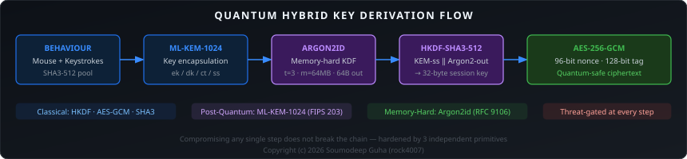
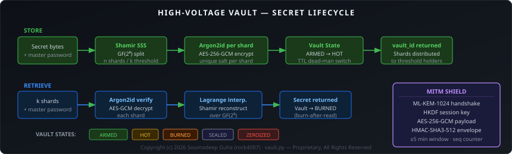

# SUMIT KEY


Generates cryptographic keys from the way you move your mouse and type — turning human behaviour into entropy.


---

## How it works

Every person moves a mouse and types differently. SUMIT KEY captures that uniqueness — the micro-jitter in mouse movements, the tiny pauses between keystrokes — and feeds it into a cryptographic pipeline to produce keys that are tied to human behaviour, not just random bytes.

**Step 1 — Capture**  
Mouse positions, velocities, direction changes, and keystroke inter-arrival times are collected in real time.

**Step 2 — Entropy extraction**  
Raw events are processed into numerical features, hashed with SHA3-512, and merged into a 512-bit entropy pool. Basic health checks reject weak or synthetic input.

**Step 3 — Key derivation**  
The pool is hardened through three independent cryptographic paths:

| Path | What it uses | Output |
|------|-------------|--------|
| Classical | HKDF-SHA3 + AES-256-GCM | 256-bit symmetric key |
| Post-quantum | ML-KEM-1024 + Argon2id + AES-256-GCM | Quantum-safe encrypted message |
| Zero-knowledge | Schnorr proof + Shamir secret sharing + Vault | Distributed secret with burn-after-read |

OS random bytes are always mixed in — behavioural entropy adds uniqueness on top of a secure baseline.

**Step 4 — Threat detection**  
Before any key is used to encrypt, a threat engine checks for bot-like mouse patterns, replay attempts, brute-force signals, and entropy anomalies. Suspicious sessions are blocked before key material is derived.

---

## Key flow



---

## Vault

The High-Voltage Vault lets you split a secret into shards using Shamir Secret Sharing over GF(2⁸). Each shard is individually encrypted with Argon2id + AES-256-GCM. Retrieving the secret requires a threshold of shards and the master password. Once retrieved, the vault is permanently destroyed.



---

## Quick start

```bash
git clone https://github.com/rock4007/generating-random-number-and-key-with-the-mouse-and-keystroke-.git
cd generating-random-number-and-key-with-the-mouse-and-keystroke-
python -m venv .venv && source .venv/bin/activate
pip install -r requirements.txt

# Generate a key from your mouse and keyboard
python main.py

# Start the REST API
uvicorn api:app --port 8000
# Interactive docs → http://localhost:8000/docs

# Open the browser dashboard
python -m http.server 8080
# → http://127.0.0.1:8080/dashboard.html
```

---

## Project layout

```
├── main.py               entry point — key generation and experiments
├── capture.py            mouse and keyboard event capture
├── entropy_engine.py     feature extraction and entropy pooling
├── key_generator.py      HKDF key derivation
├── api.py                REST API (FastAPI, 20+ endpoints)
├── dashboard.html        browser dashboard
├── security.py           security profile helpers
├── nist_validator.py     NIST SP 800-22 statistical tests
├── crypto_tools.py       ⬤ classical + quantum-hybrid encryption
├── crypto_benchmark.py   ⬤ performance benchmark suite
├── advanced_security.py  ⬤ rotating-key envelope + threat detection
├── threat_model.py       ⬤ threat model framework
├── vault.py              ⬤ ZKP · Shamir SSS · Vault · MITM Shield
├── tests/                synthetic and security validation tests
└── scripts/              utilities, demos, and NIST experiments
```

`⬤` proprietary — All Rights Reserved

---

## License

Files marked `⬤` are proprietary. All other files are MIT licensed.  
Copyright (c) 2026 Soumodeep Guha
