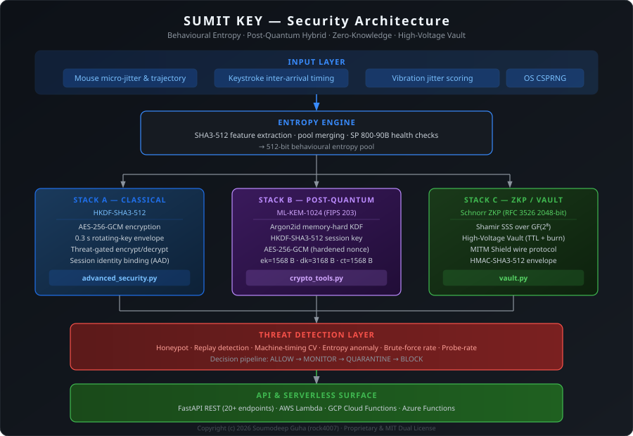

# SUMIT KEY


Cryptographic key engine driven by mouse and keystroke behavioural entropy.



---

## What it does

Captures mouse movement jitter and keystroke timing, pools them into a 512-bit entropy source, then derives cryptographic keys through a three-layer pipeline:

- **Classical** — HKDF-SHA3 + AES-256-GCM with 0.3 s rotating keys
- **Post-quantum** — ML-KEM-1024 + Argon2id + AES-256-GCM (FIPS 203)
- **Zero-knowledge** — Schnorr proofs + Shamir secret sharing + High-Voltage Vault

All encryption paths are gated by a threat detection layer before any key material is derived.

---

## Quick start

```bash
git clone https://github.com/rock4007/generating-random-number-and-key-with-the-mouse-and-keystroke-.git
cd generating-random-number-and-key-with-the-mouse-and-keystroke-
python -m venv .venv && source .venv/bin/activate
pip install -r requirements.txt
python main.py
```

Start the API server:

```bash
uvicorn api:app --port 8000
# docs at http://localhost:8000/docs
```

Open the dashboard:

```bash
python -m http.server 8080
# http://127.0.0.1:8080/dashboard.html
```

---

## License

Core security modules (`vault.py`, `crypto_tools.py`, `advanced_security.py`, `threat_model.py`, `crypto_benchmark.py`) are proprietary — All Rights Reserved.  
All other files are MIT licensed.

Copyright (c) 2026 Soumodeep Guha
